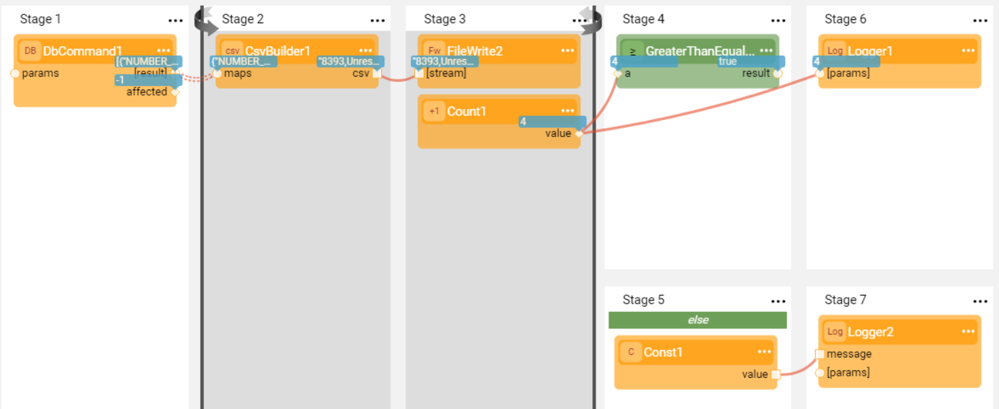

# Iterations and Conditions in a Flow

###  Exercise – Adding a Condition to a Broadway Flow 

You have just created and tested your first Broadway flow that selects data from a DB table and creates a CSV file based on the selected DB records. You have also practiced adding Stages and Actors to a Broadway flow and then adding a loop to the flow. 

Now, let's practice another Broadway flow feature - adding conditions to a flow. 

In this exercise you will add a condition to your flow that does the following:

- Checks if the number of selected records >= 3:  

  - If this condition is fulfilled, adds a message to the log file.

  - Else, adds an error message to the log file.

    

Before you start, please read [Broadway Flow - Stages](/articles/19_Broadway/19_broadway_flow_stages.md) to learn about splitting and merging the Stages of a flow and about adding conditions to a Stage. 

#### Step 1 - Open the Broadway Flow
1. Go to the **project tree** > **Shared Objects** > **Broadway** and click the flow you created in the [previous lesson](05_create_broadway_flow.md).

#### Step 2 - Add Counting of Selected Records

1. Add the **Count** Actor to **Stage 2**. This Actor returns the number of times an Actor is called. When this Actor is added to the loop, it counts the number of selected records.

#### Step 3 - Add a Condition to the Flow

In the Step, you check the number of records: check if the number of records >= 3. 

1. Add a new Stage to the flow.

2. Click  in the new Stage and select  **Stage Condition** option. A window opens where you can select the required Actor and add it to the Stage.

3. Select the **GreaterThanEquals** Actor and click  **SUBMIT**:

     - The **GreaterThanEquals** Actor returns **true** if the value of the **a** parameter is greater than or equals the value of the **b** parameter. This Actor is in grey since it is added in a condition.

     Read [Broadway Actor](/articles/19_Broadway/03_broadway_actor.md), [Broadway Actor's Properties Window](/articles/19_Broadway/03_broadway_actor_window.md), and [Built-In Actor Types](/articles/19_Broadway/04_built_in_actor_types.md) to learn more about Broadway Actors.

4. Link the output of the **Count** condition to the **GreaterThanEquals** **a** input argument.

5.  Set the **b** input argument to be a **Const** and set its value to 3.

6. Now you need to split **Stage 4** into two forks: one fork to be executed if the **GreaterThanEquals** Actor returns **true** and another fork if the **GreaterThanEquals** returns **false**:

      - Click  in **Stage 4** and select **Split**. 
      - A new **Stage 5** is created in the same level of **Stage 4**.  
      - Click  in the newly created **Stage 5** and select **Else**. 
      - Add the **Const** Actor to **Stage 5** and set its value to: *Error - there are not enough records in the list*.

#### Step 4 - Add the Next Stages

1. Add a Stage to the flow and split it into **Stage 6** and **Stage 7**.
2. Add the **Logger** Actors to **Stage 6** and **Stage 7**.
3. Set the **Logger** Actor's parameters of **Stage 6**:
   - Set the **message** input argument's population type as **Const**.
   - Set the **message** input argument's value to: *There are ${0} records in the list*.  Note that the **${0}** is used to set the value of the first parameter of the **params** input argument into the message.
   - Set the **level** input argument to **info**.
4. Link the **Count** Actor to the **Logger** Actor or to **Stage 6**.
5. Set the **Logger** Actor's parameters of **Stage 7**:
   - Connect the **message** input argument to the **Const** Actor of **Stage 5**.
   
   - Set the **level** input argument to **error**.
   
     Now you have a condition in your flow:
   
     
   
     

#### Step 5 - Debug the Updated Flow

1. Click  to execute the flow steps in Debug mode:

   <ul>
   <pre><code>
   A. What is the output value of the <strong>Count</strong> Actor? 
   B. What is the output value of the <strong>GreaterThanEquals</strong> Actor? 
   C. Which Stage has been executed - <strong>Stage 6</strong> or <strong>Stage 7</strong>? Why?
   D. Check the output of the <a href="/articles/13_LUDB_viewer_and_studio_debug_capabilities/02_fabric_studio_log_files.md">Fabric Log File</a>. Which message is given by the <strong>Logger</strong> Actor? What is the level of the message? 
   </code></pre>
   </ul>
   
   
2. Update the **GreaterThanEquals** Actor, set the **b** parameter to 10 instead of 3.

3. Rerun the Debug on the flow: 

   <ul>
   <pre><code>
   A. What is the output value of <strong>GreaterThanEquals</strong> Actor? Is it different now? Why? 
   B. Which Stage has been executed - <strong>Stage 6</strong> or <strong>Stage 7</strong>? Why?
   C. Check the output of the <a href="/articles/13_LUDB_viewer_and_studio_debug_capabilities/02_fabric_studio_log_files.md">Fabric Log File</a>. Which message is given by the <strong>Logger</strong> Actor? 
   What is the level of the message? Is it different now? Why? 
   </code></pre>
   </ul>
   
4. Change the loop close by setting it at the end of **Stage 4** instead of **Stage 3.** 

   <ul>
   <pre><code>
   A. What changes in the flow execution? Why?
   </code></pre>
   </ul>

