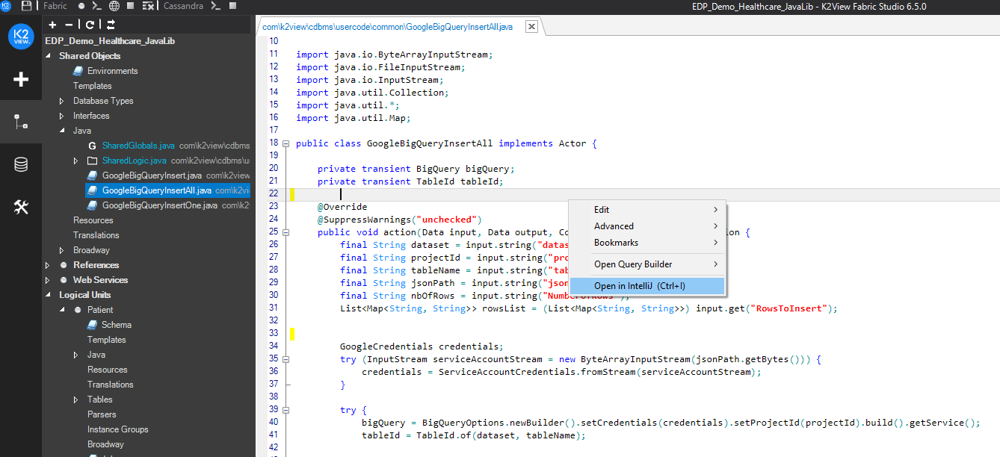
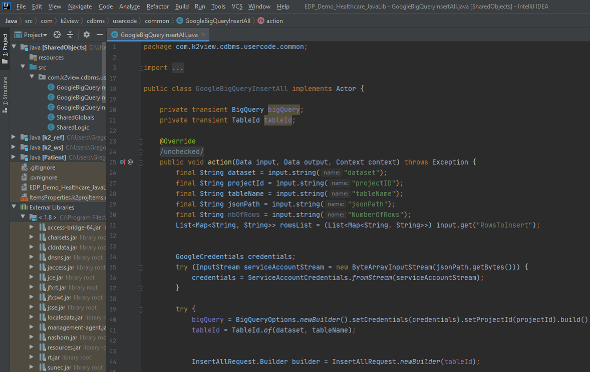

# Fabric Studio - Launching IntelliJ IDEA

## Access IntelliJ from Fabric studio
Once installed on your Windows environment, IntelliJ can be easily accessed from Fabric Studio.
To do so:
1. Right click on any Java file in your project tree,
2. Select the *Open in IntelliJ* option.

Note that you can also start IntelliJ on any java file by typing ***ctrl+I***.

IntelliJ will start in the background and open-up on the selected file:

 

- As can be seen in the figure above, all Fabric-related Java files and resources for your project are accessible from the project tree panel on the left.

- In cases where both Fabric Studio Java Editor and IntelliJ IDEA are opened, any manual code update in either environment will be instantaneously reflected in the other.

- In addition, all the libraries and dependencies featured in your project are also be exposed in the project tree.

## Code Completion
All your java extensions or Fabric built-in functions and libraries appear in the hovering menu on the code/function you are currently writing, as explained in the following articles:

-	[Basic]( https://www.jetbrains.com/help/idea/auto-completing-code.html#basic_completion)
- [Statement]( https://www.jetbrains.com/help/idea/auto-completing-code.html#statements_completion)
- [Hippie]( https://www.jetbrains.com/help/idea/auto-completing-code.html#hippie_completion)

