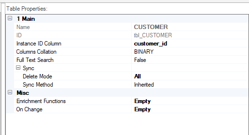

# LU Table Properties

The Table Properties tab is displayed in the right pane of the Table's window.

The Properties tab displays a list of properties that must be defined for each LU table, as follows:

<table width="900pxl">
<tbody>
<tr>
<td width="200pxl">

<strong>Main</strong>

</td>
<td width="700pxl">

Non-editable fields:

<ul>
<li>Name - LU table name.</li>
<li>ID - generated by Fabric.</li>
</ul>
</td>
</tr>
<tr>
<td width="200pxl">

<h4>Instance ID Column</h4>

</td>
<td width="700pxl">

A unique field that is used as the LU table Instance ID.</a>

</td>
</tr>
<tr>
<td width="200pxl">

<h4>Columns Collation</h4>

</td>
<td width="700pxl">

There are 3 options:

<ul>
<li>BINARY - (default) compares the exact string in the field with the SQL statement.</li>
<li>NOCASE - enables the Select statement to ignore upper/lower case fonts when comparing text fields. For example:   Select TYPE from tblExample where NAME = &lsquo;value&rsquo; returns records when the NAME field is set either to &lsquo;VALUE&rsquo; or &lsquo;value&rsquo;.</li>
<li>RTRIM - enables the Select statement to ignore white space characters on the right of the string when comparing text fields. For example:  Select TYPE from tblExample where the NAME = &lsquo;value&rsquo; returns records that match both &lsquo;value&rsquo; and &lsquo;value &lsquo;.</li>
</ul>
</td>
</tr>
<tr>
<td width="200pxl">

<h4>Full Text Search</h4>

</td>
<td width="700pxl">

When set to True, it enables the use of the MATCH Sqlite command as part of the WHERE clause of a Select statement that reads data from a Fabric table. Default = False.

Click for more information about the Match command:

<a href="http://www.sqlite.org/fts3.html#section_3">http://www.sqlite.org/fts3.html#section_3</a>

</td>
</tr>
<tr>
<td width="200pxl">

<h4>Sync Method</h4>

</td>
<td width="700pxl">

There are 4 <a href="/articles/14_sync_LU_instance/04_sync_methods.md">Sync methods</a>:

<ul>
<li>None.</li>
<li>Inherited (default).</li>
<li>Time Interval.</li>
<li>Decision Function.</li>
</ul>
</td>
</tr>
<tr>
<td width="200pxl">

<h4>Delete Mode</h4>

</td>
<td width="700pxl">
    
Fabric 6.5.9 adds the Delete Mode property to the LU table. This property replaces the previous Truncate Before Sync LU table's property and defines the delete policy of the previous records in the LU table (populated previous to the current sync). The values are <strong>All</strong> (default value), <strong>Off</strong>, or <strong>NonUpdated</strong>: 

        <li>All - the entire LU table is truncated before the populations are executed.</li>
        <li>Off - the previous records are not deleted.</li>
        <li>NonUpdated - delete only the previous records that are not updated by the current sync (old data). 
       

       
Click <a href="/articles/14_sync_LU_instance/04_sync_methods.md#delete-mode-and-truncate-before-sync-properties">here </a> for more information about the Delete Mode.
  
   
Notes:

   <ul>
    <li>It is recommended to set the <strong>NonUpdated</strong> value when the LU table has <a href="/articles/18_fabric_cdc/01_change_data_capture_overview.md">CDC fields</a> in order to send <a href="/articles/18_fabric_cdc/03_cdc_messages.md">CDC messages</a> only for the updated records. If the Delete Mode is set to All, Fabric sends delete messages for all the truncated records and inserts messages for the newly inserted records.</li>
    <li>If the Delete Mode is NonUpdated, it is recommended to define a PK on the LU table and set the <a href="/articles/07_table_population/04_table_population_properties_tab.md#target-lu-table-properties">LU table population mode</a> to Upsert or Update in order to delete only the old data. If the LU table does not have a PK, new records are added to the LU table and all previous records are deleted.</li>
 </ul>
</td>
</tr>
<tr>
<td width="200pxl">  

<h4>Enrichment Functions</h4>

</td>
<td width="700pxl">

Refers to <a href="/articles/10_enrichment_function/01_enrichment_function_overview.md">Enrichment Functions</a> that are executed after all LU tables are populated.

<ul>
<li>The execution order is determined on an LU level and is based on the Sync policy of the attached table. When no Enrichment function is attached - the display is &lsquo;Empty&rsquo;.</li>
<li>When one or more Enrichment functions are attached - the display is &lsquo;&lt;x&gt; enrichments&rsquo; (where &lt;x&gt; is the number of attached Enrichment functions).</li>
</ul>

To select an Enrichment function, click the 3 dots next to the Enrichment functions property and select the function name. Only functions without input and output parameters are displayed.

</td>
</tr>
</tr>
<tr>
<td width="200pxl">  

<h4>On Change</h4>

</td>
<td width="700pxl">

Refers to <a href="/articles/07_table_population/11_4_creating_a_trigger_function.md">Trigger functions</a> that are executed when there is a change in LU table's data.

To select a Trigger function, click the 3 dots next to the On Change property and select the function name. Only Trigger functions are displayed.

</td>
</tr>
</tbody>
</table>    

   

   

========================================================         

</td>
</tr>
<tr>
<td width="200pxl">

<h4>Enrichment Functions</h4>

</td>
<td width="700pxl">

Refers to <a href="/articles/10_enrichment_function/01_enrichment_function_overview.md">Enrichment Functions</a> that are executed after all LU tables are populated.

<ul>
<li>The execution order is determined on an LU level and is based on the Sync policy of the attached table. When no Enrichment function is attached - the display is &lsquo;Empty&rsquo;.</li>
<li>When one or more Enrichment functions are attached - the display is &lsquo;&lt;x&gt; enrichments&rsquo; (where &lt;x&gt; is the number of attached Enrichment functions).</li>
</ul>

To select an Enrichment function, click the 3 dots next to the Enrichment functions property and select the function name. Only functions without input and output parameters are displayed.

</td>
</tr>
</tr>
<tr>
<td width="200pxl">

<h4>On Change</h4>

</td>
<td width="700pxl">

Refers to <a href="/articles/07_table_population/11_4_creating_a_trigger_function.md">Trigger functions</a> that are executed when there is a change in LU table's data.

To select a Trigger function, click the 3 dots next to the On Change property and select the function name. Only Trigger functions are displayed.

</td>
</tr>
</tbody>
</table>

