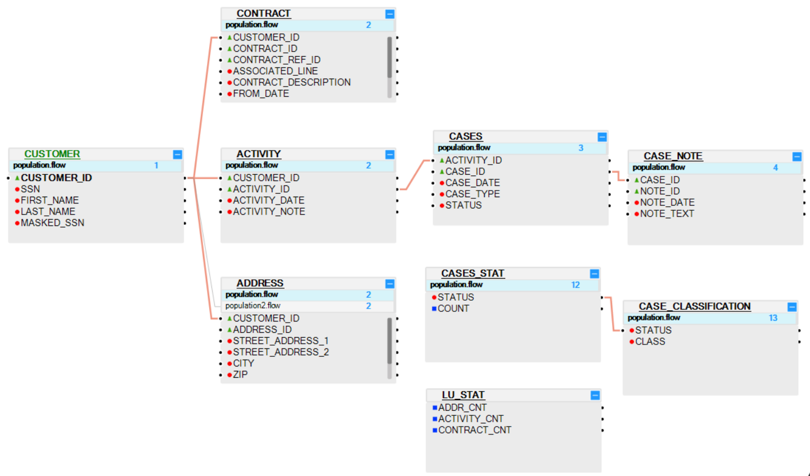

# Business Tables

The ability to create business tables and to store them in the LU schema has been added to Fabric V6.5.4. 
Business tables are stand-alone LU tables that have no connection (direct or via other LU tables) to the LU Root table. They might have one or more populations, or might not have any populations. Several business tables can be connected one to another.

Business tables allow the user to compute, transform and store new data inside the LU MicroDB. 
Such data could be statistics, LUI-based calculations, or a mix of different functions and populations. 

In the example below, we can see different examples for such tables:

- **CASES_STAT** business table has one population and no parent tables.

- **CASE_CLASSIFICATION** business table has one population and has another business table - CASES_STAT - as its parent table.

- **LU_STAT** business table has no populations and no parent tables.

Note that considering the flexibility of the population types introduced with these tables, the appropriate population [execution order](/articles/07_table_population/13_LU_table_population_execution_order.md) will need to be carefully set by the user, otherwise the table will not be populated as required. 

