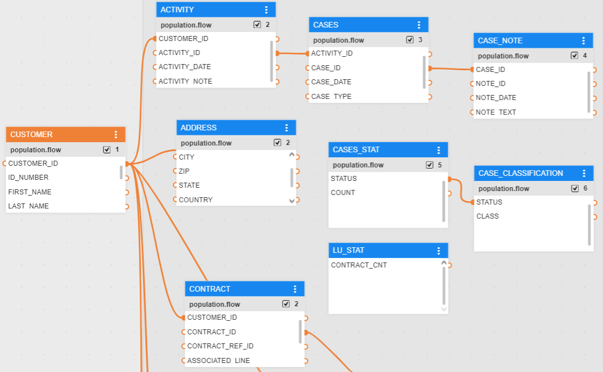

# Business Tables

Business tables are stand-alone LU tables that have no connection (direct or via other LU tables) to the LU Root table. They may have one or more populations, or no populations at all. Several business tables can be connected one to another.

Business tables allow the user to compute, transform and store new data inside the LU MicroDB. 
Such data could be statistics, LUI-based calculations or any other business logic.

The below displays an example for various business tables:

- **CASES_STAT** business table has one population and no parent tables.

- **CASE_CLASSIFICATION** business table has one population and an associated business table - CASES_STAT - as its parent.

- **LU_STAT** business table has no populations and no parent tables.

<studio>

</studio>

<web>

</web>

Considering the flexibility of the population types introduced with these tables, the appropriate population [execution order](/articles/07_table_population/13_LU_table_population_execution_order.md) would need to be carefully set by the user, otherwise the business tables could not be populated as required. 

Note that when creating a population for a business table with no parent, the **SourceDBQuery** Actor should be replaced by the **DbCommand** Actor and have no connection to the **PopulationArgs** Actor as shown below:

