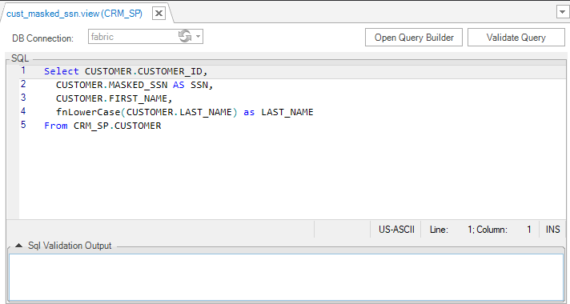
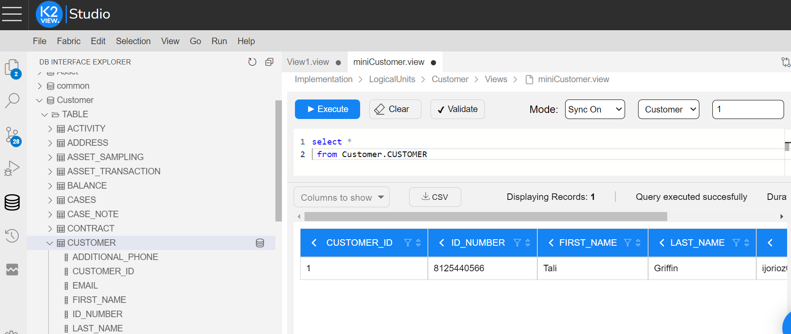

# Data Product / Logical Unit Views

### Overview

Starting from Fabric V6.5.8, **Logical Unit views** are introduced to Fabric. 

**Views** are designed to keep a pre-defined query on [LU tables](01_LU_tables_overview.md) in the Fabric MicroDB, allowing an easy access to a required data collection.

The SQL statement of the view can include a SELECT statement from one LU table or several joint LU tables. Additionally, it supports the use of [LUDB functions](/articles/07_table_population/11_3_creating_an_LUDB_function.md). 

Views are part of the [Logical Unit](/articles/03_logical_units/01_LU_overview.md) definition; however, they are not part of the Schema. Views are populated with data at the end of the sync process, after all Logical Unit tables population has been completed. 

A view's column data type is the same as the respective Logical Unit table's column data type. Views don't have their own properties and can't be indexed. 

There are two techniques in which Logical Unit view data can be accessed: either via a direct querying of an instance's MicroDB or via the Declarative field level authorization mechanism. When using the latter technique, the query on an Logical Unit table is replaced by a query on an Logical Unit view. This replacement is based on a security profile of a Fabric user's role.

[Click for more information about Declarative field level authorization mechanism](/articles/17_fabric_credentials/04_fields_level_authorization.md).

Note that once an Logical Unit view is connected to a security profile, it cannot be accessed directly by a query on MicroDB. This restriction is done in order to prevent unauthorized access to sensitive data.

[Click for more information about Security Profiles](/articles/17_fabric_credentials/05_security_profiles.md).

### How Do I Create a New View?
<studio>
1. Go to **Project Tree** > **Logical Units** > [**Logical Unit Name**], right-click **Views** > **New View** to display the **View** window.
2. Create an SQL statement that represents the view. You can do it by either clicking on **Open Query Builder** or by writing the query manually.
3. Once the query is ready, click on **Validate Query** in order to validate the syntax. 
4. Save the view. 

</studio>

<web>

1. Go to Project Tree > Implementation > Logical Units / Data Products

   - Choose the relevant data product 

   - Right-click on the *Views* folder of the selected data product

   - Choose *New View* from the opened context menu

     

   - Name the new View. Press **Enter** to confirm or **Escape** to cancel.

     

2. Following the new view creation, you can either type the view's query by your own or be assisted by the Studio's Query Builder. 
   To create the query with Query Builder:

   - Click on DB Interface Explorer icon () on the Activity Bar
   - Choose "fabric" and the data product.
   - Choose a table or some of its columns (appear when expanding the table), right-click on it and  choose Add Select Statement at the opened context menu.
   - The accordingly select statement will appear at the Views Editor screen.

3. You can validate the query using the Validate button.

4. You can check the view's outcome by clicking on Execute button. For this, you shall populate the Instance ID box. Note that data product (logical unit) is prepopulated.

5. Save the view.

6. Clicking on Execute runs the Select statement, which results with a display of a created view at the bottom half of the main window.

   

</web>

