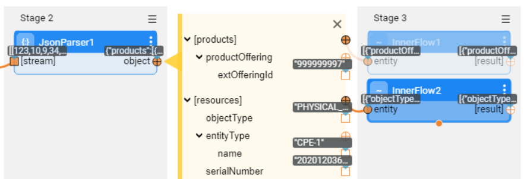

# Complex Iteration Flows
### Overview

When the originating Actor's output is a complex object, the iteration's complexity increases due to the object's internal hierarchy of fields and nested arrays. Thus the iteration logic over an object with multiple links is impacted by the answers to the following questions:

* Are the connected elements on the same level of hierarchy or on different levels?
* Are the link types the same (all **Iterate**) or different (**Iterate** combined with other types)?
* Do the connected elements belong to different nested arrays, and if yes - do they have the same or a different size? 

This article describes how Broadway performs complex iteration use cases, such as:

* Looping over multiple elements of a complex object on different levels of the object's hierarchy, for example a field and a nested array.
* Using different connection line types when iterating over a complex object's elements.

If the connected elements of the object are on the same level of hierarchy such as two fields of the same array, the iteration's behavior is the same as an iteration over [two or more elements in a result array](21_iterations.md#iterate-over-two-or-more-elements). 

To get more information about the use cases on how to iterate over a loop with conditions and handle the Actors output correctly, refer to [Iterations With Conditions article](21b_iterations_with_condition.md).

### Iterate Over an Element and a Nested Array

* The connected elements are on different levels of hierarchy: the **serialNumber** field in a [resources] array and the **objectType** field in a [hardware] nested array.
* Both are connected using the **Iterate** link type. 
* The iteration runs over all **serialNumber** fields of the [resources] array, and for each **serialNumber** over all **objectTypes** in the **[hardware]** nested array.

### Iterate Over a Field and Take a Nested Array by Value

- The connected elements are on different levels of hierarchy: the **serialNumber** field in the [resources] array and the **[hardware]** nested array.
- The **serialNumber** is connected using the **Iterate** link type, while the **[hardware]** nested array is connected using the **Value** link type.
- The iteration runs over all **serialNumber** fields of the [resources] array, and for each **serialNumber** takes all the hardware (the nested array's data).

### Iterate Over a Field and Take a First Value of a Nested Array

* This is a private case of the previous scenario with the same connected elements.
* The **serialNumber** is connected using the **Iterate** link type, while the **[hardware]** nested array is connected using the **First** link type.
* The iteration runs over all **serialNumber**fields  of the [resources] array, and for each **serialNumber** takes the first element of its hardware nested array.

### Take an Array by Value and Iterate Over a Field in the Same Array

* The connected elements are on different levels of hierarchy: the **entityType** field is in the [resources] array and the **[resources]** array.
* The **entityType** is connected using the **Iterate** link type, while the **[resources]** array is connected using the **Value** link type.
* The iteration runs over all **entityTypes** of the [resources] array while during each iteration, the map of the current resource is passed by a value.

### Iterate Over Multiple Arrays

The originating Actor's output can have more than one collection. A common use case is a JSON data structure that contains more than one array.
Occasionally there may be a requirement to manage several loops over the same data structure, for example to combine the data from two arrays or to perform other types of data manipulation. In this case, both arrays (or elements in the arrays) must be connected using an **Iterate** link type to one or more Actors. 

The iteration logic is impacted by the answers to the question - do these arrays have the same or a different size? When the arrays have a different size, at some point one array ends and returns a null while another array still has values. To prevent the redundant loops over the empty array, split the flow and create a Stage Condition to check if the array returns a value or a null.

Another recommended way to handle two collections of different sizes is to use [Inner Flows](22_broadway_flow_inner_flows.md). You can pass each array by a value into its respective inner flow and then iterate within each inner flow on the array's values.

