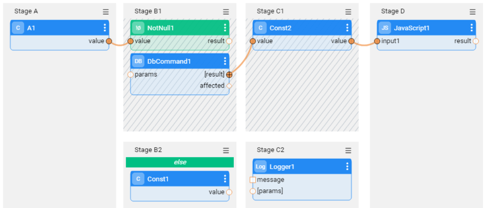
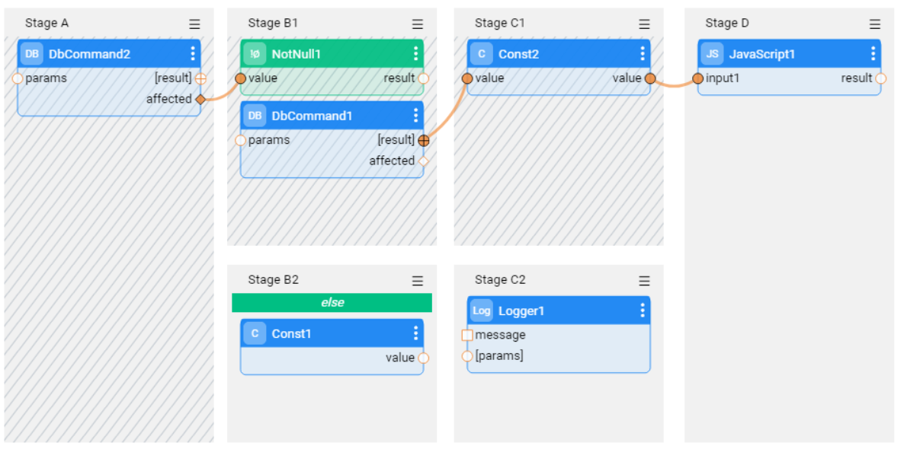

# Transactions

### Transaction Definition

- Broadway has a built-in Transactions Management mechanism. The transaction starts when the [Actor](03_broadway_actor.md) in a [Stage](19_broadway_flow_stages.md) marked as a transaction requests to start a connection. 
- Several sequential Stages marked as transactions are part of the same transaction.
- The transaction ends after the last Stage marked as a transaction or at the end of the flow and is followed by a commit (or by a rollback if there are errors). 

### Transaction in Inner Flows 

Transactions can include [inner flows](22_broadway_flow_inner_flows.md). If a transactional Stage executes an inner flow, it automatically becomes a part of the outer transaction and can use its shared resource.

When the outer flow starts the transaction and then invokes an inner flow, the inner flow does not close the transaction. The transaction is closed by the outer flow.

### Transaction in Iterations

The transaction ends after the last Stage marked as a transaction. A transaction's behavior during an iteration is based on marking of the Stages within the [iteration](21_iterations.md). 

* If all the iteration's Stages are transactional, the transaction continues and commits after the data set is completed. 
* If an iteration includes a non-transactional Stage, the transaction is committed  and then a new transaction is started for each iteration in the data set. 

**One Commit Example**

The **Load** Stage inside the loop is transactional. The **Source** Stage before the loop can be transactional or not. The commit is performed at the end of the data set. 

**Commit Per Each Iteration Example**

If a non-transactional Stage is added at the end of the loop, the commit is performed per each iteration.

**Commit Every X Records Example**

When the data set is very big (for example, 1M records) and a commit is required every X records, you can do it using a Stage Condition and the **JavaScript** Actor. 

The following example shows how to perform a commit every 5 records. Writing the following code, Stage 1 is only reached every fifth record:

~~~javascript
var i = contextLoop.index();
(i+1)%5 == 0;
~~~

The transaction is then committed since Stage 1 is not marked as transactional and a new transaction begins.

**Commit During an Iteration Example**

The following is an example of a transaction's behavior in the loop when not all Stages inside the loop are transactional.  

- The transaction begins at the **Load** Stage and is followed by a commit since the **Commit** Stage is not transactional.
- Then the second transaction begins at the **Load 2** Stage and is followed by a commit in the second iteration after the end of **Load** Stage. At the end of data set, the commit occurs at the end of the loop.

### Impact of Error Handling on Transactions

When an [Error Handler](24_error_handling.md) is defined on the transactional Stage of the flow and it catches an error, the Error Handler can either be true to continue the flow or false to stop the flow. If the Error Handler returns false, the transaction ends with a rollback and the flow's execution stops. The error message displays the failure reason.

### Impact of Stage Conditions on Transactions

When the flow is split due to [Stage conditions](/articles/19_Broadway/19_broadway_flow_stages.md#what-is-a-stage-condition), the transaction can be defined for only some branches. For example, for an IF-ELSE condition, you can define that the transaction occurs only when the condition is true. 

In the example below, the transaction starts in Stage B1 if the condition is true and ends after the completion of Stage C1. If the condition is false, there is no transaction in this flow.

In the second example, the transaction starts in Stage A. If the condition is true, the transaction ends after the completion of Stage C1. If the condition is false, the transaction ends at the end of Stage A.

Note that if there are several conditions or too many parallel branches in the flow, it is not recommended to use the Transactions mechanism across the branches.

### Shared and Non-Shared Transactional Interfaces

Fabric [Interfaces](/articles/05_DB_interfaces/01_interfaces_overview.md) used in a Broadway flow can be shared or non-shared during the transaction.

* Using a **shared** interface in a flow, Fabric opens a connection only once within the same transaction, when the first Actor calls this interface. All other Actors use the same connection. Shared interfaces used by Broadway are: DB Interface, file system or SFTP.
* Using a **non-shared** interface, Fabric establishes a connection each time an Actor calls the interface in the flow. A non-shared interface used by Broadway is HTTP.  

### How Do I Mark or Unmark a Stage as a Transaction?

In a Broadway flow window, a **Transaction** is marked by blue diagonal lines in the Stage's background and can span across several [Stages](19_broadway_flow_stages.md).

<table>
<tbody>
<tr>
<td valign="center" ><strong>To mark</strong> a Stage, click  > Transaction.</td>
<td valign="center" ><strong>To unmark</strong> a Stage, uncheck Transaction.</td>
</td>
</tr>
<tr>
<td valign="center" ></td>
<td valign="center" ></td>
</td>
</tr>
</tbody>
</table>

### NoTx Actor

Starting from Fabric V6.5.8, you can mark an interface as non-transactional in the context of an active transaction using the **NoTx** Actor. It is used to exclude an interface from a transaction so it will not get the **begin**, **commit** and **rollback** commands.

If the Actor is called outside a transaction or the interface in question is already part of the active transaction, an exception will be thrown.

The use case for using this Actor is  the Clone Entity flow in TDM which requires Fabric to be marked as non-transactional interface in order to prevent locking of the LUI SQLite file while the transaction is open on target DB.

[Click for more information about the TDM Clone Entity](/articles/TDM/tdm_gui/17_load_task_regular_mode.md#entity-clone-synthetic).

