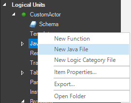
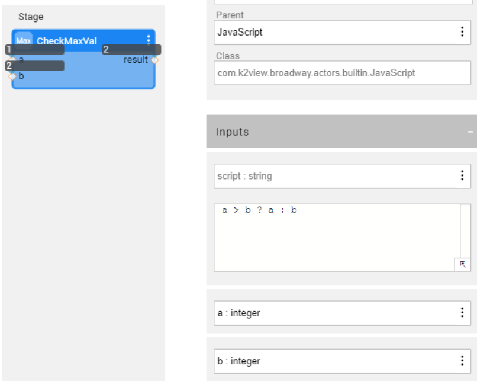

# Actor Editor

### Overview

The Broadway [Actors inheritance mechanism](06_export_actor.md) enables reusing the same business logic in different places in a flow or in several flows of the project. 

If an inherited Actor needs to be modified, open the Broadway flow with this Actor, edit it and save the updated Actor via the **Export Actor** menu with the **Override Current** option. 

To simplify the Actor modification process and enhance it with additional editing options, Broadway provides an **Actor Editor** which enables creating new Actors and editing inherited ones.  

The Actor Editor can be accessed by opening the **[Actor Name].actor** file from the Project tree. It is displayed as a dummy flow with one Actor that can be setup / modified using the extended Actor's [Properties window](03_broadway_actor_window.md).

### How Do I Use an Actor Editor?   

The Actor Editor can be used to create a new inherited Actor or modify an existing one via its **[Actor Name].actor** file. The Actor must inherit either from another Actor or from an [Inner Flow](22_broadway_flow_inner_flows.md) that has been saved as an Actor. 

**To create** a new Actor, do the following:

1. Right click the **Broadway** folder in the Project tree and click **New Actor**.
2. Populate the new **Actor's name** and click **OK** to open the Actor Editor.
3. Select the **Parent Actor** to get the parent's input and output arguments. 
4. Debug the Actor by running it from the Main menu toolbar. If the Actor receives input parameters, they can be set using the [Debug / Run Arguments](25_broadway_flow_window_run_and_debug_flow.md).
5. Save the Actor.

**To modify** an Actor, do the following:

1. Go to the **Broadway** folder in the project tree and double click the ***.actor** file to open the Actor Editor.
2. Modify the required settings, for example set a value of an input argument.
3. Debug the Actor by running it from the Main menu toolbar. The Actor's input parameters can be set using the [Debug / Run Arguments](25_broadway_flow_window_run_and_debug_flow.md). 
4. Save the Actor. The change impacts every flow where this Actor is used.  

### How Do I Create a New Actor from Scratch?

Broadway enables you to create an Actor that inherits its properties and behaviors from a custom Java class rather than from another Actor.

**To create** a new Actor from scratch, do the following:

1. Create your own Java class: Right click the **Java** folder in the Project tree either in the Shared Object or under the Logical Unit. Then click **New Java File**.

   

2. Define the class as follows to inherit the core Actor's properties and behaviors:

   ~~~java
   public class <class_name> implements Actor {
   }
   ~~~

   Or

   ~~~java
   public class <class_name> extends <core_actor_name> {
   }
   ~~~

3. Implement an **action** method to define the Actor's logic. For example, when the Actor has an input argument **caseId** and an output argument **status**, the method will be as follows:

  ~~~java
  @Override
  public void action(Data input, Data output) throws Exception {
      final String caseId = input.string("caseId");
      try {
          //your logic ....
          output.put ("status", "OK");
      } catch (Exception e){
          handleError(e, output);
      }
  }
  ~~~

4. If the Actor maintains a state, implement a **close** method to reset it.

5. Since the Actors are serialized when running in [Recovery mode](29_recovery_point.md) and their input/output values are serialized to be displayed in the Data Viewer, make sure that Actor, its members and input/output fields are either serializable or transient. 

6. Once this new Java class is ready, create a new Actor. Right click the **Broadway** folder and click **New Actor**.

7. Populate the **Class** with your Java class's path. For example, when the Java class is located under the Logical Unit, the class is:

   ~~~java
   com.k2view.cdbms.usercode.lu.<lu_name>.<class_name>
   ~~~

8. Click **Add Input** and **Add Output** to define the Actor's input and output arguments according to the Java class definition. Note that the Actor's input and output arguments must correspond the Java class definition. 

### Examples of New Actor Creation

**New Actor Which Inherits from Existing Actor**

Let's create a new **CheckMaxVal** Actor that inherits its properties and behaviors from a **JavaScript** Actor: It receives two integers and returns their maximum value. Do the following:

1. Right click the **Broadway** folder in the Project tree and click **New Actor**.
2. Populate the **CheckMaxVal** Actor's name and click **OK**.
3. Define the Actor as follows:
   * Set Badge to **Max**.
   * Clickin the **Parent** field to select the parent using the **Add Actors** window.
   * Populate the **script** input argument with the regex: **a > b ? a : b**.
   * Click **Add Input** to add two input arguments and update their names to **a** and **b**.     
    
4. Set the values of an Actor's input parameters using the [Debug / Run Arguments](25_broadway_flow_window_run_and_debug_flow.md) in the Main menu toolbar and debug the Actor.
5. Once the debug has finished, close the Actor Editor and add the Actor to the required flow.

**New Actor Which Inherits from Custom Java Class**

When creating a new Actor which inherits from custom Java class, do all the steps until the selection of **Parent**. Instead, populate the **Class** with your customer Java class name. 

Then define the required input and output arguments and run the Actor to debug it. 

​		

