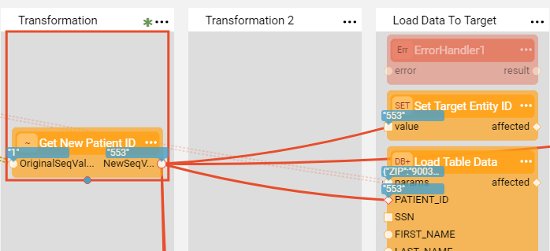

# Sequence Implementation Guide

Broadway enables generating and setting new sequences before loading data into a target database. Various sequence patterns can be implemented via the **MaskingSequence** Actor and other Broadway features.

This article describes the most useful use cases of sequence implementation by Broadway. 

### Sequence Caching

A common scenario of sequence implementation is when the same sequence needs to be used per entity across several flows during the same execution. The following use cases of sequence caching are supported:

* Using a sequence across several tables of the same LU. For example, Customer ID is a sequential field in the CUSTOMER LU and is populated in several LU tables such as CUSTOMER and SUBSCRIBER. 
* Using a sequence across different LUIs within the same LU. For example, the same ADDRESS ID can be used for different customers during the same execution.
* Using a sequence across different LU types. For example, the same CUSTOMER ID can be used in a CUSTOMER LU and a Billing LU during the same execution.

To implement the above use cases, set a unique **maskingId** and populate it on the **MaskingSequence** Actor everywhere the same sequence is used. Keep the **useEnvironment** as **true** and the **useExecutionID** as **true** in each Actor's settings to generate a new masked value in each execution in the same environment or set it to **false** to use the same masked value across different executions and environments.

### Sequence Next Value

The sequence next value implementation method depends on the sequence definition set by the **sequenceInterface** input argument. The following use cases are supported:

* IN-MEMORY, useful for testing only since it can be used only in a single node configuration.
* Redis or DB sequence. To implement the DB sequence, set the **maskingId** to hold the sequence name defined in the **sequenceInterface** DB.  

### Sequence Initiation Method

Sequence initiation can be performed using the **initialValue** and the **increment** settings of the Actor and is relevant for in-memory or [Redis interface](/articles/24_non_DB_interfaces/09_redis_interface.md) only. In a DB sequence these attributes are managed by the DB. Note that the initial value is cached on the Actor's first execution. The following use cases are supported:

* Initialize the sequence using the constant initial value, for example 1000000.
* Initialize the sequence using another Broadway flow by setting the flow name in the **initialValue** argument. The Actor invokes the flow to calculate the sequence's initial value. Note that the flow must return an external variable named **initialValue**. 

### Sequence Mapping

In Broadway sequences can be mapped in a number of ways. The following use cases are supported:

* Map the old value to the new value.

  

* When there is no old value to be mapped to the new value and the target table requires a sequence, leave the input value empty. The Actor generates a new sequence and returns it in its output. This feature is applicable as of Release 6.4.1.

  

* Set the sequence as part of the attributes list. An example of the attributes list can be a string which concatenates several pairs of keys and values including the sequence as one of them. To do so, generate the sequence and then create the concatenated attributes list using the [**JavaScript** Actor](01_javascript_actor.md).

   

* Set the sequence in a specific format, for example SQ|date(Ym)|BR[value]|[new_seq]. To do so, generate the sequence and then use the **MaskingLuFunction** Actor to mask the input value with the result of the LU function's execution. Selection of the LU and the function are implemented by the **MaskingLuFunction** Actor in the same way as by the [**LuFunction** Actor](/articles/19_Broadway/09_broadway_integration_with_Fabric.md#lufunction-actor).

  

* Set the sequence value based on a condition, for example generate the sequence value only for some entries based on a given condition. To do so, define a [Stage Condition](../19_broadway_flow_stages.md#what-is-a-stage-condition) in the Broadway flow. 

  

* Replace the IID with a new sequence. This use case is the same as mapping the old value to the new one.

  

* When parent-child relationships exist across Logical Units, the same sequence can exist in both the parent and children. The updated flow can be executed on the parent LU to add a child sequence. For example, the Customer LU is a parent while the Order LU is a child. After the population of both the Customer and Order LUs is completed, update the Customer LU with the sequence from the Order LU.

* Store the relationship between the old and the new sequence. To do so, create a flow that stores these values in the Cassandra **TDM_SEQ_MAPPING** table under the [k2masking keyspace](/articles/02_fabric_architecture/06_cassandra_keyspaces_for_fabric.md), for example for reporting purposes. 

* Clone the entities when required. Different sequence values are generated for each cloned entity. This functionality is supported as part of the [TDM7 implementation](/articles/TDM/tdm_implementation/02_tdm_implementation_flow.md). 

  

