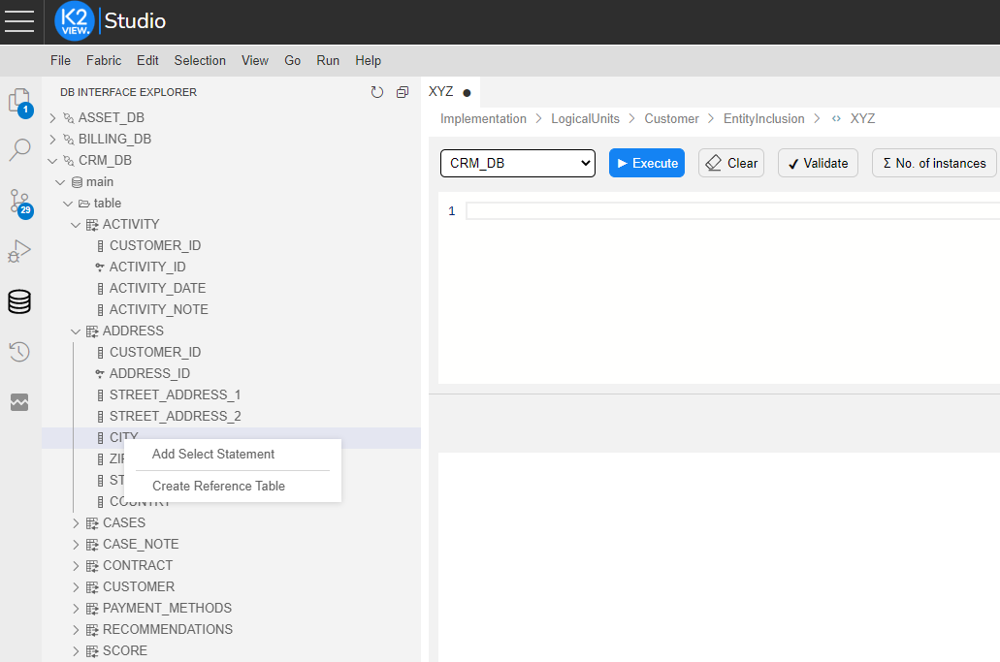
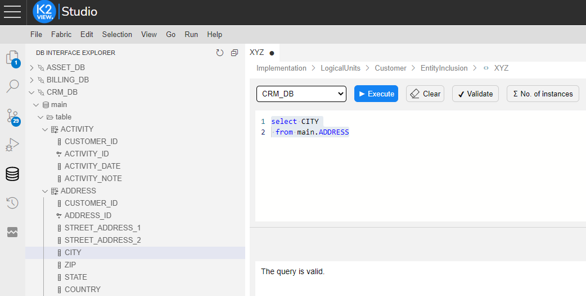
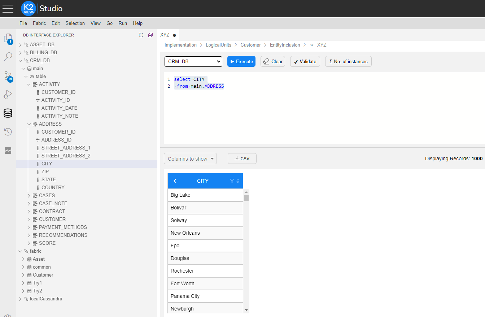

# Instance Groups

## How Do I Create a New Instance Group?

<studio>

1. Go to the **Fabric Studio**, select the **LU** > **Instance Groups** and right click and select **New Instance Group**.
2. Write a valid **SQL query** to select the instances to be included in the Instance Group.
   * The query can be written using the Query Builder by clicking **Open Query Builder**.
3. Validate the query by clicking **Validate Query**.
4. Save the **Instance Group**.


The Instance Group is deployed together with its LU.

</studio>

<web>

1. Go to Project Tree > Implementation > Logical Units / Data Products

   - Choose the data product

   - Right-click on the *Instance Groups* folder

   -  Choose/click on *New Instance Group* from the opened context menu 

     

   -  A message pops up, asking you to name the new instance group. When done, press **Enter** to confirm or **Escape** to cancel.

      

      > Note: The name should start with a letter and should contain only alphanumeric characters and underscore.

2. Following the new instance group creation, write a valid SQL query to select the instances to be included in the Instance Group. The query can be written manually or by using the DB Explorer to build it.

   - When writing the SQL query manually pick a suitable DB from the top drop down list in the main window
   
     
   
   - When using the DB Explorer to build it
   
      - Click on DB Interface Explorer icon () on the Activity Bar
     - Choose the DB interface which shall be used to build the instance group.
     - Choose the relevant table, then select **1** column only from it. Right-click on the column and choose *Add Select Statement*

       

       Clicking on this message populates the Instance Group Editor area.

3. Validate the SQL statement by clicking on the Validate icon in the top bar. A message is consequently appeared at the bottom results panel.

     

     >  Note: As mentioned above, **only 1** column from a table should be selected. In case you've mistakenly chosen more than that, the validation process would yield the following message: *The query must return one column only.*
         

4. Clicking on the Execute icon (in the top bar) runs the select statement, which results with a display of the newly created instance group at the bottom result panel. Of course this shows the current result and can hint about the actual results that will yielded on runtime.

   

</web>


## How Do I Invoke an Instance Group from the Batch Command

**Example** 

    BATCH Customer.customer_IG_600To700 FABRIC_COMMAND="sync_instance CUSTOMER.?" with JOB_AFFINITY='10.21.2.102' async='true';

The Instance Group is defined from Fabric Studio - *customer_IG_600To700*

Result:

All instances with ID values between 600 and 700 are synced into Fabric.

```fabric>BATCH Customer.customer_IG_600To700 FABRIC_COMMAND="sync_instance CUSTOMER.?";```

```
|Added|Updated|Unchanged|Failed|Total|Duration|
+-----+-------+---------+------+-----+--------+
|99   |0      |0        |0     |99   |875     |
```


[](/articles/20_jobs_and_batch_services/13_migrate_commands.md)[](/articles/20_jobs_and_batch_services/15_batch_broadway_commands.md)

</studio>

