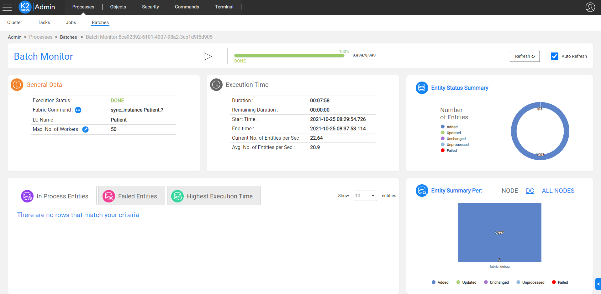
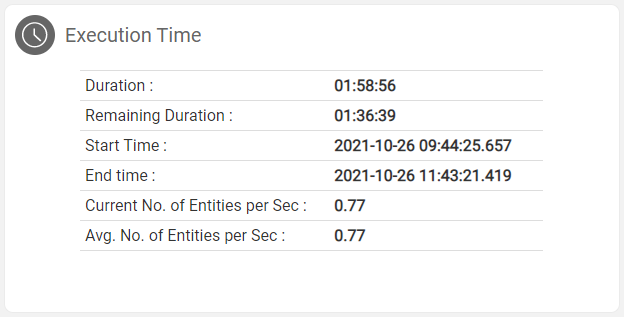
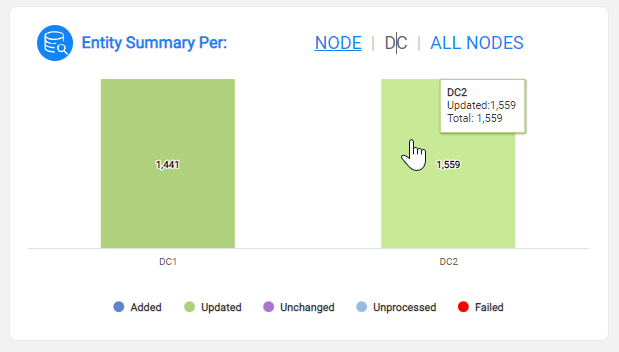
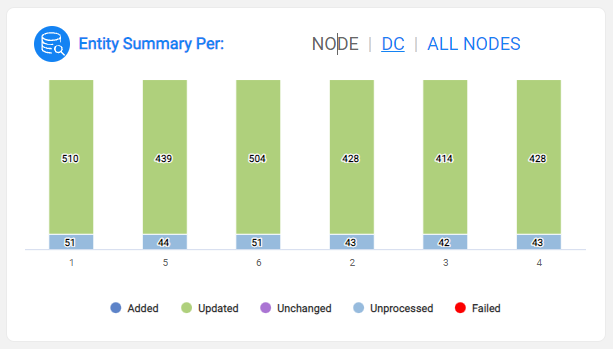

# **Fabric Batch Monitoring Window**

## **Overview**  

The batch monitoring window has been added to Fabric version 6.5.3. 

It has been designed to enable the user to monitor the execution and get a detailed information of a given batch process. In addition it enable the user to edit the maximum number of workers and stop a running batch process or resume a paused batch execution. It delivers real-time and historical insights such as the performance or the success/failure rates of the processes per node, per entity or per status basis.  

## **Batches Window**  
This window displays the list of batch processes in Fabric based on the filter criteria. In addition it enables to start a new batch process to sync entities to a selected LU. 


Go to the batch list winfow: navigate to **Admin > Processes > Batch** to open the batch process.

Note that if the batch status is **GENERATE_IID_LIST**, i.e. the batch process is still generating the entity list,  the Completion column displays a spinner, since the total number of entities is unknown at this stage and the completion percentage cannot be calculated till the the entity list is generated:


Each batch process has its own record. Select the ```...``` button in the left side of each record and select **monitor** option to open the Batch Monitor window on the selected batch process:


The Batches window also enables to cancel, pause or resume a selected batch process. Note that a cancelled batch cannot be resumed.

## **Batch Monitor Window** 

The Batch Monitoring window can be accessed from Fabric's [Web Admin](/articles/30_web_framework/01_web_framework_overview.md) Batches window: 





### Batch Monitor Control Panel

The batch Monitor Control banner allows you to cancel, pause, resume a paused batch process, and retry a completed batch process. It provides a progress bar that indicates the number of entities already processed and the number of entities yet to be processed.

Note that a cancelled batch process cannot be resumed. 


#### GENERATE_IID_LIST Status

Batch processes that run on a large number of entities may take some time till the full entity list is generated. When the list generation starts and the batch status is GENERATE_IID_LIST, the total number of entities is still unknown. During the entity list processing, the control panel displays a running spinner, and the total number of entities flashes to indicate that the number of entities is still in process and not final at this stage:


### General Data

The general data section brings the related information of the batch process: execution status, Fabric command, LU name, and maximum number of workers:

#### Execution Status:
Provides the status of the current batch process as defined by the [batch_summary](/articles/20_jobs_and_batch_services/12_batch_sync_commands.md#batch_summary) command

#### Fabric Command:
The actual batch command being processed. All details can be viewd by clicking on this sign: 

The fully detailed list of tha batch process (resulting from the execution of the [batch_info](/articles/20_jobs_and_batch_services/12_batch_sync_commands.md#batch_info) command) will be displayed as illustrated below:


#### Edit Max. No. of Workers
This parameter can be modified during the execution time and defines the number of threads allocated to this batch process. The value can be adjusted by clicking on the following icon: . 

Notes:

- The maximum number of workers is set on each node that runs the batch process.

- The maximum number of workers cannot exceed the maximum number of workers defined in the [config.ini](/articles/02_fabric_architecture/05_fabric_main_configuration_files.md#configini)file (MAX_NO_OF_WORKERS parameter).


### Execution Time

This panel displays the information resulting from the execution of the [batch_summary](/articles/20_jobs_and_batch_services/12_batch_sync_commands.md#batch_summary) command. The information is displayed on the cluster level. 




### **Entity Status Summary**

This panel provides a pie-chart view of the status of the entities being processed. See the illustration below: 


Note that when the batch status is **GENERATE_IID_LIST** the number of the unprocessed entities is still not final and can grow when the entity list is finalized.

### **Entities Detailed Status**

Entities are categorized into 3 different groups:
- Entities in process
- Failed entities: displays a list of failed entities and their error message.
- Entities with the highest execution time

This allows you to drill down on each instance's execution and identify bottlenecks, issues or unexpected behaviors.


Each table shows the following details for each entity:
- Entity ID
- Node ID
- Process time in ms
- Status


#### In Process Entities

Click the  icon to check for the stuck processes. This option activates the **ps command** with the task ID of the selected entity.

#### Highest Execution Time

Click the  icon to and select the **Data Explorer** to open the Data Explorer web application on the entity and identify possible bottle checks in the LUI sync. Note that if there are additional LUs whose name contains the name of the batch's LU, for example, Customer and Customer_Extract LUs, you can select the required LU.  The Data Explorer is opened in a new tab. This selection option can be used when running a data migration process that syncs two LUs: extract and load LUs. 


### **Batch process monitoring per Node or per Data Center**

The summary of the execution of the batch process is shown on a per-node basis or across the Data Centers responsible for the execution of the process.

- DC-centric report:




​			Click each one of the DCs to open the **Nodes Execution Summary** window with the summary record on each node related to the selected DC:


- Node-centric report:




​		Click each one of the nodes to open the **Nodes Execution Summary** window with the summary record on the selected node.


- All Nodes: click this option to open the **Nodes Execution Summary** window with the summary record on the all nodes that run the batch process.


Note that when the batch status is **GENERATE_IID_LIST** the number of the unprocessed entities is still not final and can grow when the entity list is finalized.

[](17_batch_process_flow.md)

