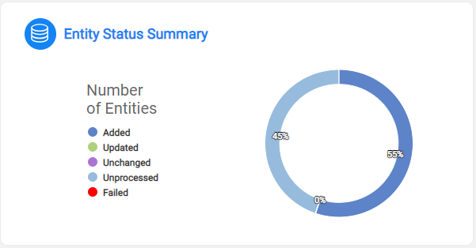

# **Fabric Batch Monitoring Panel**

## **Overview**  

The batch monitoring dashboard has been added to Fabric version 6.5.2.

It can be accessed from Fabric's [Web Admin](/articles/30_web_framework/01_web_framework_overview.md) panel by doing the following steps:
- Navigate to **Admin > Processes > Batch**,
- Select the ```...``` button in the first column of the batch processes table - 
- Select the **Monitor** item of the *menu*. as illustrated in the picture below:


You will need to ensure that a batch processes is being executed or has been previously executed. 

The picture below shows how to create a new batch process or how to access a previously executed batch process:


## **Batch Monitor Dashboard** 

Once you clicked on the **Monitor** item of the *menu*, the following dashboard will appear:


### **Batch Monitor**

The batch Monitor Control banner allows you to cancel, pause and resume the batch process currently in focus. 
It provides a progress bar that indicates the number of entities already processed and the number of entities yet to be processed.


### **General Data**

Execution Status:
Provides the status of the current batch process as defined by the [batch_summary](/articles/20_jobs_and_batch_services/12_batch_sync_commands.md#batch_summary) command

Fabric Command:
The actual batch command being processed. All details can be viewd by clicking on this sign: 

The fully detailed list of tha batch process (resulting from the execution of the [batch_list](/articles/20_jobs_and_batch_services/12_batch_sync_commands.md#batch_list) command) will be displayed as illustrated below:


Max. No. of Workers:
This parameter can be modified during the execution time and defines the number of threads allocated to this batch process. The value can be adjusted by clicking on the following icon: .


### **Execution Time**

This panel displays the information resulting from the execution of the [batch_summary](/articles/20_jobs_and_batch_services/12_batch_sync_commands.md#batch_summary) command.


### **Entity Status Summary**

This panel provides a pie-chart view of the status of the entities being processed. See the self-explanatory illustration below 




### **Entities Detailed Status **

Entities are categorized in 3 different groups:
- Entities in process
- Failed entities
- Entities with the highest execution time

This allows you to drill down on each instance execution and identify bottlenecks, issues or unexpected behaviors.


Each table shows the following details for each entity:
- Entity ID
- Node ID
- Process time in ms
- Status

By right-clicking on the  sign will redirect you to the table showing the details for the node that processed this specific entity.


### **Batch process monitoring per Node or per Data center **

The summary of the execution of the batch process is shown on a per-node basis or across the Data Centers responsible for the execution of the process.


