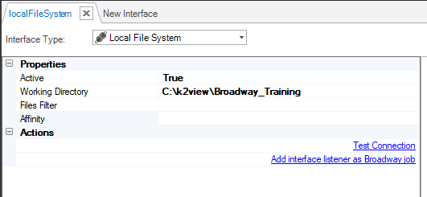

# Local File System Interface

The Local File System interface type enables processing files from a local directory in a specific Fabric server.

A Local File System interface can be used when creating an [Interface Listener for a Broadway flow](/articles/19_Broadway/09_broadway_integration_with_Fabric.md#interface-listener-for-broadway-flows). The directory can be either Windows or Linux. 

To create a new interface, do the following:

<studio>

1. Go to **Project Tree** > **Shared Objects**, right click **Interfaces**, select **New Interface** and then select **Local File System** from the **Interface Type** dropdown menu to open the **New Interface** window.

   

2. Populate the connection's settings and click **Save**.

</studio>   

<web>

1. Go to **Project Tree** > **Shared Objects**, right click **Interfaces**, select **New Interface** and then select **Local File System** from the **File System** section to open the **New Interface** window.

2. Enter a suitable name for your new Local File System Interface, then click **Create**:
   

3. Populate the connection's settings and click **Save**.
   

</web>   

### Connection Settings

<table>
<tbody>
<tr>
<td width="200pxl">&nbsp;<strong>Parameter</strong></td>
<td width="700pxl">&nbsp;<strong>Description</strong></td>
</tr>
<tr>
<td>&nbsp;<strong>Working Directory&nbsp;</strong></td>
<td>Directory where the files are stored - Windows or Linux.</td>
</tr>
<tr>
<td>&nbsp;<strong>Files filter</strong></td>
<td>Filters files.</td>
</tr>
<tr>
<td>&nbsp;<strong>Affinity</strong></td>
<td>Affinity (Optional) populate this parameter with the IP address of a Fabric node, DC name, or logical identifier for Fabric nodes.</td>
</tr>
</tbody>
</table>

### Example of Using a Local File System Interface

To create an [Interface Listener](/articles/19_Broadway/09_broadway_integration_with_Fabric.md#interface-listener-for-broadway-flows) Job in a Local File System interface, do the following: 

1. Create an interface using a **Local File System** interface type.

2. Click the **Add interface listener as Broadway job** link in the Interface window and select the [Logical Unit](/articles/03_logical_units/01_LU_overview.md) from the list to open the Jobs window. 

3. Create a Broadway flow either under Shared Objects or under the same Logical Unit. The flow reads data from a file using the predefined interface and populates it into the DB. 

   

   * Note that the **interface** and the **path** input arguments of the **FileRead** Actor are defined as an [External link type](/articles/19_Broadway/03_broadway_actor_window.md#actors-inputs-and-outputs). Their values are passed from the defined interface by the Listener.

<studio>
   
4. In the Jobs window, select the **Broadway flow** and **Execution mode** and then save the job.

   

5. [Deploy the LU](/articles/16_deploy_fabric/02_deploy_from_Fabric_Studio.md) to activate the Listener.

</studio>

 
