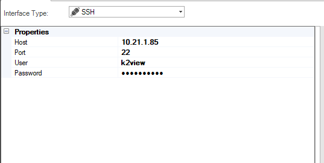

# SSH Interface

The SSH interface type defines the communication details with a remote machine using SSH protocol.

To create a new SSH interface, do the following:

1. Go to **Project Tree** > **Shared Objects**, right click **Interfaces**, select **New Interface** and then select **SSH** from the **Interface Type** dropdown menu to open the **New Interface** window.

   

2. Populate the connection's settings and click **Save**.

### Connection Settings

<table>
<tbody>
<tr>
<td width="300pxl"><strong>Parameter</strong></td>
<td width="600pxl"><strong>Description</strong></td>
</tr>
<tr>
<td><strong>Host</strong></td>
<td>Hostname or IP address of the remote server.</td>
</tr>
<tr>
<td><strong>Port</strong></td>
<td>Port of the remote server.</td>
</tr>
<tr>
<td><strong>User</strong>&nbsp;</td>
<td>Username.</td>
</tr>
<tr>
<td><strong>Password&nbsp;</strong></td>
<td>Password.&nbsp;</td>
</tr>
</tbody>
</table>

### Example of Using an SSH Interface

To create a Broadway Flow that runs on an SSH interface, do the following: 

1. Create an interface using **SSH** interface type.

2. Create a Broadway flow either under Shared Objects or under a Logical Unit. Add a new Actor called SSH Actor, use the Interface defined in Step one and use the ls command.

   

   

   

