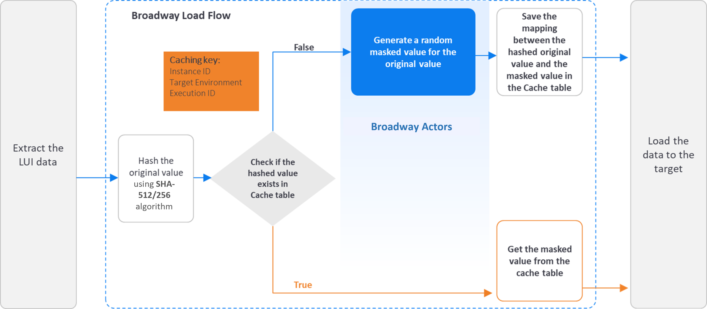

# Fabric Data Masking

Data Privacy laws require the ability to mask data by hiding the original values with modified content. 
Fabric provides a field-level API to protect data classified as Personal Identifiable Information, sensitive personal data, or commercially sensitive data.

To ensure that the data are still valid for your data lifecycle management, the masked data will look real and appear consistent.

This capability can be used to conduct tests, implement data transformations, or serve anonymized data to external third parties via web services or queue messages.

## Masking Flow

The masking of sensitive data can be done either by the [LUI sync](/articles/14_sync_LU_instance/01_sync_LUI_overview.md) using the [LU Table Population Broadway Flow](/articles/07_table_population/14_table_population_based_Broadway.md) (which masks the data before it is saved into Fabric), or by using a Broadway flow to mask the LUI data before it is loaded to the target.

The following diagram describes the masking process of sensitive data using an **LUI sync**:

The following diagram describes the masking process of sensitive data **before loading the data to the target**:

### Broadway Masking Actors

The masking process is executed by Broadway actors that enable masking sensitive data before they are loaded into a target database or even into Fabric. The masking process contains the generation (manufacturing) of a random synthetic value that replaces the real value, and the caching of the hashed original value and the masked value in order to keep the referential integrity of the data. 
Starting from V7.1, Fabric separates data generation (manufacturing) from the hashing and caching capabilities. Broadway provides the following actors: 

1. Various of data generation actors under the **generators** category to generate a random synthetic value. For example: RandomString, RandomNumber, Sequence...
2. **Masking** actor - this actor can wrap any data generation Actor and add the hashing and caching capabilities on the top of the data generation Actor.
3. Broadway still keeps the existing masking Actors for backward compatibility reasons.

The masking Actors use the Fabric hashing utility to hash the original value and save the mapping of the hashed value and the masked value to the cache table.

Click [here](/articles/19_Broadway/actors/07_masking_and_sequence_actors.md) to read how to use fabric's masking Broadway actors.

Click [here](02_fabric_entities_design.md#fabric-hashing-mechanism) to read more about Fabric hashing mechanism.

#### Customized Masking Logic 

K2view enables users to create their own masking functions:
- The **MaskingLuFunction** Broadway actor can be used to call a customized function (a shared function or an LU's function) to mask the required field.  
- The **MaskingInnerFlow** Broadway actor can be used to call a customized Broadway flow or an actor to mask the required field.
- Fabric 7.1 provides the general **Masking** actor that enables to run a customized inner flow or an actor to mask the required field.

The use of **MaskingLuFunction**, **MaskingInnerFlow**, or **Masking** actors guarantees the usage of the K2view masking mechanism including **SHA-512/256** hashing and caching.  The user does not need to handle them by their customized function.

### Masking Actors Properties

#### Target Value Uniqueness

- The user can decide whether the masked value is unique per original value (hashed value) or if it can be used for more than one original value. For example, a masked SSN must be unique, but a masked Family Name can be the masked value of different original values. 

#### Cache with Expiration date

- Each cached link of hashed value to masked value can have a TTL (Time To Leave). This link will expire once the TTL is reached, and the original value will be masked again

#### Caching Level Parameters

- The caching of the masked values can be saved on different levels based on the user’s input. Each one of the following parameters can be enabled or disabled from being part of the **Caching key**:
  - Instance ID
  - Target Environment
  - Execution ID

## K2View Masking Advantages

- Supports **cross instances consistency** based on the hashed values.
- The original value is not used as input for creating the random masked value, other than for formatting purposes.
- **In memory** processing. The MicroDB is created with the masked values.
- Uses the Fabric Masking mechanism (using **SHA-512/256** algorithm).
- **Multiple masking options** enable maximal flexibility when masking the data.

## De-Anonymization (Pseudonymization)

In some cases there is a business need to retrieve the original value of the masked LUI. For example, retrieve a mailing address in order to contact the customer. 

There are two recommended approaches to support de-anonymization and retrieve the original value of the masked field: 

- Keep the source Instance ID in Fabric and use it to retrieve the original data from the source system.

- Keep the encrypted version (each Instance is encrypted separately) of the original values in *Fabric only*, in addition to the anonymized values. Limit the access to the anonymized data only. Only permitted users can access the original values.

Click [here](/articles/26_fabric_security/03_fabric_LUI_encryption.md) for more information about the LUI encryption.

