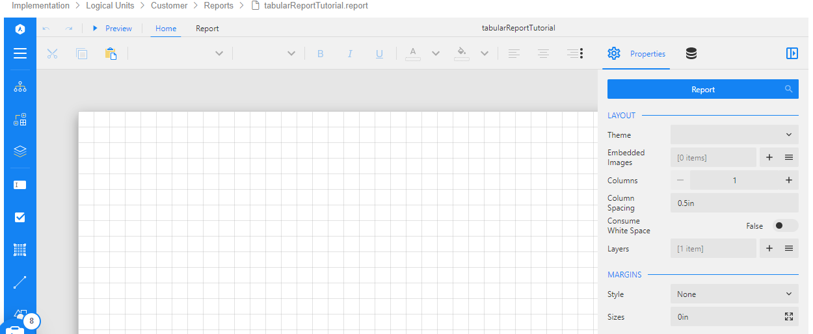

# Report Creation

The reports creation is comprised of the following steps:

1. Define a data source and data set(s) in an empty report canvas. 
2. Validate the data set(s) and define the input parameter(s).
3. Create the data binding between the report elements and the data set's fields. 
4. Set the report's layout design (fonts, colors, etc.).

This article describes how to create a new report and how to define its data source and data set(s). The next articles explain about additional steps of the report creation.

### New Report

To initiate a new report creation, go to the Logical Unit in the project tree, right-click on **Reports > New Report** and populate the report name. Click Enter to create and open an empty report canvas. 



### Data Source Configuration

Data binding establishes a connection between a report and the displayed data, starting with the addition of a data source.

To create a data source, click the  icon in the **Data Sources** area of the report's properties. It provides a choice of two templates:

- The **fabric_api** data source is defined as the **/api/** Fabric endpoint that runs under your Fabric's host. This is a default data source to be used for any Fabric API (built-in or custom).

- The **custom data source** is an empty template that allows to define any required endpoint, by setting the following properties:

  - **Endpoint** - either a full-path or a base URL of your REST API. Then the endpoint paths are appended by using data sets (described later on in this article).

  - **HTTP Headers** - a collection of HTTP Header fields that are passed with the request. 

  - **Query Parameters** - a collection of name/value pairs that define the Query String of the URL.

### Data Set Configuration

Each data source may contain one or more data sets. 

To create a data set, click the  icon near the data source name in the **Data Sources** area of the report's properties. It provides a choice of several Fabric endpoint templates and a custom data set definition.

**Data Set Based on Fabric Endpoints** 

The Fabric endpoints include the following templates:

* **luTable**, defined by ```lu/{luName}/{@iid}/{table}``` Fabric endpoint.
* **luQuery**, defined by ```lu/Customer/{@iid}``` Fabric endpoint.
* **commonTable**, defined by ```common/{table}``` Fabric endpoint.
* **command_get**, defined by ```fabric-command``` Fabric endpoint.

When one of the above templates is selected, the New Data Set window opens with pre-defined **Uri/path** and **Parameters** that correspond to the selected template, as per the following logic:

* The ```{luName}``` of the Fabric endpoint is pre-populated with the name of Logical Unit under which the report is created. 
* The ```{table}``` is pre-populated with the TABLE_NAME constant and should be updated to the required LU Table name. 
* The **Uri/path** of the Fabric Endpoint templates includes a parameter ```iid```, which hasn't yet been defined for this report. [Click to learn how to define the new parameter]() or follow the steps of this guide until you reach the step of parameters definition.

It is recommended to update the default data set name to a meaningful name, for example:


**Custom Data Set Definition**

The **custom data set** allows defining any required endpoint, by setting the following properties:
* **Uri/path** - the value depends on the configuration of the parent data source. If the data source's endpoint is the full URL, the data set's Uri/path should be empty. If however the data source's endpoint is the base URL, then the data set's Uri/path should contain the full URL of the data endpoint.
* **Method** - specifies the request method. The supported methods are GET and POST.
* **Parameters** and **Headers** - the purpose of these properties is the same as one of **Query Parameters** and **HTTP Headers** properties of the data source. 
* **Json Path** - JSON data endpoints can retrieve the data of various shapes, and there is no standardized data structure. Hence, it is required to specify the structure using the [JSONPath expression](https://goessner.net/articles/JsonPath/). You can use `$.*` or `$[*]` JSONPath expression to specify the repeated data fragments.


Note that templates for Data Source and Data Set creation are available for new reports only. When adding a data source or a data set to an existing report, New Data Source and New Data Set windows will open, requiring a manual population of all details. 


Proceed to the next step of this user guide to perform the data set validation.


[](01_reports_overview.md)[](03_data_set_validation.md) 
