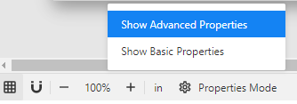

<web>

# Report Designer

### Overview

The reports creation is performed using the **Designer** component, which is embedded into the Fabric Studio. It is comprised of the following steps:

1. Define a data source and data set(s) in an empty report canvas. 
2. Validate the data set(s) and define the input parameter(s).
3. Create the report layout and bind the report elements to the data set's fields. 
4. Design the report's layout: fonts, colors, borders, etc.

This article describes how to initiate a new report creation. The following articles in this user guide explain about the additional steps.

### New Report

To initiate a new report creation, go to the Logical Unit in the project tree, right-click on **Reports > New Report** and populate the report name. Click Enter to create and open an empty report canvas. The report is created with a continuous page layout, which means that a data region (such as a table) would grow until there is no more space on the current page and then another page would be produced. 

Now, click anywhere on the gray area around the report layout to load the report properties in the **Properties Panel**. Here you can set various report level properties. For example, margins style and size.

Note that you can control the Properties mode - Basic or Advanced - via the setting at the bottom of the page:

 

</web>
