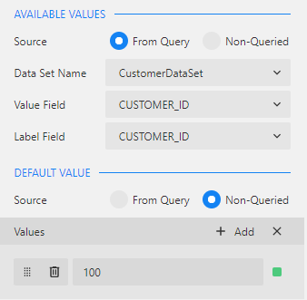

<web>

# Parameters Creation

Defining parameters is required often, when creating data sources and data sets, especially those using Fabric endpoints. For example, if you configured your data set using the [```lu/{luName}/{@iid}/{table}``` Fabric endpoint](02_create_new_report.md#data-set-configuration) - an IID will have to be provided in order to generate the report. 

### How Do I Create Report Parameters?

To create a new parameter, click the  icon in the **Parameters** area of the report's properties. An EDIT PARAMETER window opens in the properties area, allowing you to define a parameter by setting its **Name** and **Prompt**.


Additionally, you can define the list of the parameter's valid values and/or a default value. Both types of values can either come from a data set or use 'hardcoded' values.




[](03_data_binding.md)[](05_quick_data_binding_with_Fabric.md)

</web>
