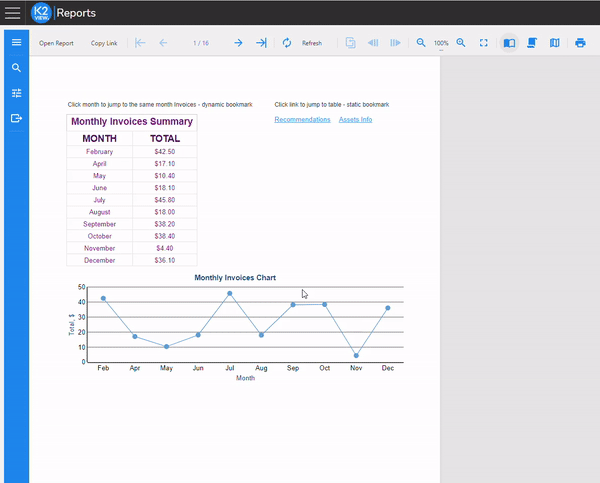

# Report Layout Design

### Overview

Fabric's **Reports** application provides various controls to enable visualizing your data in many different ways. The examples of controls are:

* **Tables** - a flexible control that allows grouping, headers and footers, aggregates, sorting, etc. Individual cells can host other controls such as image and more. This report displays tabular data in rows and columns.
* **Lists** - a free-form layout for repeating data record.
* **Input fields**, various types of **charts**, **pivot tables**, and many more. 

[Click for more details about various ActiveReportsJS layout features.](https://www.grapecity.com/activereportsjs/demos/)

### Tabular Reports

A tabular report is the most straightforward way to visualize your data, in a multicolumn, multirow fashion. A tabular report can group, sort, and filter the data based on pre-defined conditions or user input.

There are two ways to creating a data binding in a tabular report's layout:

1. Selecting the data set fields and drag-and-drop them into a report page - like this:

   

2. Dragging the Table control  from the report's toolbox. In this case, you still need to connect the table with respective data set fields - like this:

   

The next step should be the table formatting, which may include the formatting of the cells font size, color, alignment, for both the detail and the header rows.

All the above activities are done on report items using the Properties panel located on the right side of the report designer. Clicking on each report element (cell, column, detail row, header column, table) displays its properties. 

You can also create grouping, summarize the data on a group or header/footer level, apply conditional formatting, interactive sorting, create bookmarks and jump to them, and more. 

Once the table is added to the report page and data binding is in place, you need to click Preview to see the report layout with the data.

### Example

Below is an example of a tabular report that demonstrates several features:

[Click for the full user guide of Tabular report creation.](https://www.grapecity.com/activereportsjs/docs/ReportAuthorGuide/QuickStart/get-started-with-/Tutorial-1-Tabular-Report)

 

