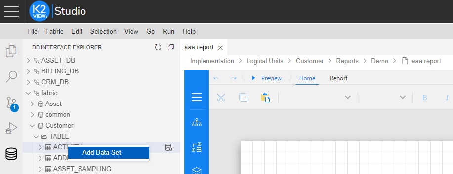
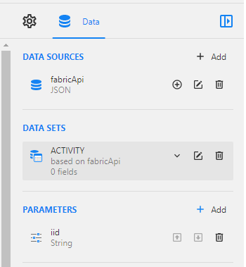

<web>

# Quick Data Binding With Fabric

The article [Data Binding](03_data_binding.md) describes all the steps needed to configure a data source and a data set in a report. Additionally, there is a quick way to configure the data binding with Fabric built-in endpoints. The following steps describe how to do it:

1. Right-click on **Reports > New Report** and populate the report name to create a new report.

2. Click on  icon on the Studio Toolbox to switch to the DB Interface tree.

3. Drill down to the required interface and table on which you'd like to create a report, do right click and select **Add Data Set**. 

   

4. As a result, the data source, data set and a parameter are automatically created:

   

5. Note that you still must validate the data set. Open the newly created data set and click Validate. [Click for more information regarding Data Set validation.](03_data_binding.md#data-set-validation)

 

</web>
