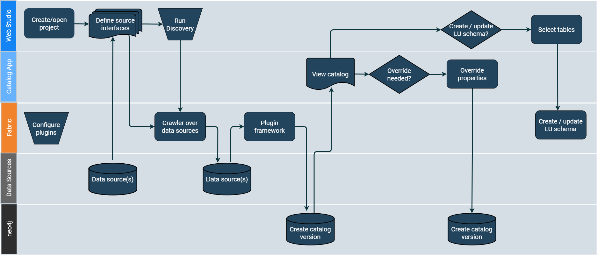

<web>

# E2E Data Discovery Process

The K2View Data Discovery process is depicted in the below diagram and it includes the following major steps:

* Start by open Fabric project (new or existing) in the Web Studio, defining data source interface(s) and initiating the Data Discovery job (Crawler).
* The plugins configuration is an optional step, since the solution comes with a set of built-in rules. If needed, additional rules can be created which can either extend or override the existing rules.
* The Crawler scans the data source, while identifying the existing entities and the relationships between them. The Crawler's output is the Discovery Schema.
* The next step is a Plugin Framework which is triggered automatically upon the Crawler completion. The Plugin Framework is a platform to execute predefined rules (plugins) and enhance the Discovery Schema accordingly. Example of business rules are: 
  * Create a link (relation) between two objects.
  * Profile the field's data and categorize it (e.g. email, phone, gender).
  * Determine if a field is PII.

* Upon the completion of the Plugin Framework execution, the Discovery Schema is saved into neo4j Graph DB, creating the Catalog version. 
* Once the process is completed, the Logical Unit schema can be created based on the Data Discovery process results.

</web>