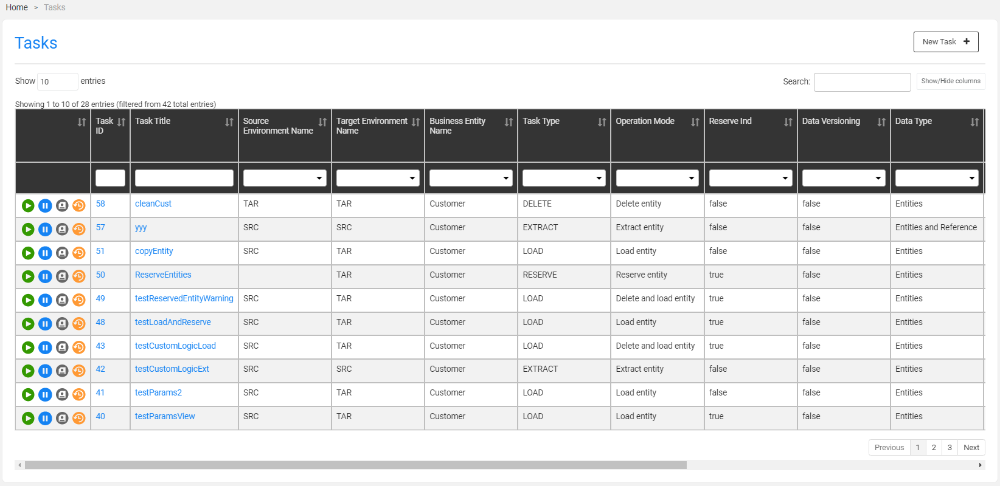
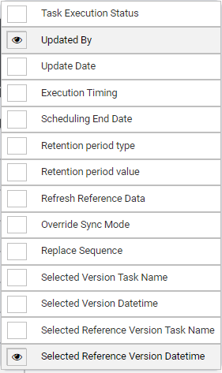

# TDM Task Overview

Data provisioning and entity reservation are implemented by creating and executing TDM tasks. 

A TDM task is created in the TDM Portal. It holds a list of instructions and settings that define the task action (type) and subset of processed entities, the source and target environments and additional information. For example, create a task to copy 5 customers with small and medium business plans from Production into the UAT1 target environment.

The actual data provisioning and/or entity reservation is performed by the task execution where each task can be executed multiple times.

## Task Actions (types)

The following task actions are supported by TDM:

- **Extract** - extracts the selected entities and/or Reference tables from the selected source environment. The data can be saved in Fabric for later use. use.
- **Generate** - generates synthetic entities. The entities can be saved in Fabric for later use
- **Load** - provisions  the selected entities and/or Reference tables to the selected target environment.
- **Delete** - deletes the selected entities from the target environment.
- **Reserve** - reserves the selected entities in the target environment.

A TDM task can have a combination of multiple task actions.

The following table describe the valid combinations of task actions on a TDM task: 

<table width="900pxl">
<tbody>
<tr>
<td width="300pxl">

<strong>Combination</strong>

</td>
<td width="600pxl">

<strong>Description</strong>

</td>
</tr>
<tr>
<td width="300pxl">

Extract

</td>
<td width="600pxl">
<ul>
<li>Extract the data from the source environment into the TDM warehouse.</li>
</ul>
</td>
</tr>
<tr>
<td width="300pxl">

Extract + Load

</td>
<td width="600pxl">
<ul>
<li>Refresh all data from the source and provision(load) the data to the target environment.</li>
</ul>
</td>
</tr>
<tr>
<td width="300pxl">

Extract + Load + Reserve

</td>
<td width="600pxl">
<ul>
<li>Extract the data from the source environment.</li>
<li>Provision (load) the data to the target environment and mark the entities as reserved.</li>
</ul>
</td>
</tr>
<tr>
<td width="300pxl">

Extract + Load + Delete

</td>
<td width="600pxl">
<ul>
<li>Extract the data from the source environment.</li>
<li>Delete and reprovision (reload) the data to the target environment.</li>
</ul>
</td>
</tr>
<tr>
<td width="300pxl">

Extract + Load + Delete + Reserve

</td>
<td width="600pxl">
<ul>
<li>Extract the data from the source environment.</li>
<li>Delete and reprovision (reload) it to the target environment.</li>
<li>Mark the entities as reserved.</li>
</ul>
</td>
</tr>
<tr>
<td>

Generate

</td>
<td>
<ul>
<li>Generate synthetic entities</li>
</ul>
</td>
</tr>
<tr>
<td>

Generate + Load

</td>
<td>
<ul>
<li>Generate synthetic entities.</li>
<li>Provision (load) the generated entities to the target environment.</li>
</ul>
</td>
</tr>
<tr>
<td>

Generate + Load + Reserve

</td>
<td>
<ul>
<li>Generate synthetic entities.</li>
<li>Provision (load) the generated entities to the target environment.</li>
<li>Mark the entities as reserved.</li>
</ul>
</td>
</tr>
<tr>
<td width="300pxl">

Load

</td>
<td width="600pxl">
<ul>
<li>Get the data from the TDM warehouse and provision it to the target environment.</li>
</ul>
</td>
</tr>
<tr>
<td width="300pxl">

Load + Reserve

</td>
<td width="600pxl">
<ul>
<li>Get the data from the TDM warehouse and provision it to the target environment.</li>
<li>Mark the provisioned entities as reserved.</li>
</ul>
</td>
</tr>
<tr>
<td width="300pxl">

Load + Delete

</td>
<td width="600pxl">
<ul>
<li>Get the data from the TDM warehouse.</li>
<li>Delete and reprovision (reload) it to the target environment.</li>
</ul>
</td>
</tr>
<tr>
<td width="300pxl">

Load + Delete + Reserve

</td>
<td width="600pxl">
<ul>
<li>Get the data from the TDM warehouse.</li>
<li>Delete and reprovision (reload) it to the target environment.</li>
<li>Mark the entities as reserved.</li>
</ul>
</td>
</tr>
<tr>
<td width="300pxl">

Delete

</td>
<td width="600pxl">
<ul>
<li>Delete (clean) the entities from the target environment.</li>
</ul>
</td>
</tr>
<tr>
<td width="300pxl">

Reserve

</td>
<td width="600pxl">
<ul>
<li>Reserve entities in the target environment.</li>
</ul>
</td>
</tr>
</tbody>
</table>

## Who Can Create a Task?
-  Admin users.
-  Environment owners can create a TDM task for their environment.
-  Testers who can create a TDM task for the environments they are attached to by a [TDM Environment Permission Set](10_environment_roles_tab.md):
   - Source environment, testers must be attached to the source environment by a permission set with [Read](10_environment_roles_tab.md#read-and-write-and-number-of-entities) access.
   - Target environment, testers must be attached to the target environment by a permission set with [Write](10_environment_roles_tab.md#read-and-write-and-number-of-entities) access.

## TDM Tasks List Window

The TDM Task List displays by default the list of all Active tasks in the TDM. 
It displays the following settings on each task. These settings can also be used to filter the displayed tasks:

- Task ID.
- Task Title: task name.
- Task's source and target environments.
- BE name.
- Task Action: Extract, Generate, Load, Delete, or Reserve.
- Task's Operation mode. An additional information about the task when multiple task types are set in the task. For example: Delete and load entity.
- Reserve Ind: indicates if the task [reserves](/articles/TDM/tdm_architecture/08_entity_reservation.md) the entities.
- [Data Versioning](15_data_flux_task.md): true / false.
- Data Type: Entities and/or Reference 
- Selection Method: selection criteria for entities.
- Number of processed entities.
- General parameters like created by user and update date. 

The following screenshot shows an example of the TDM Task List. 

  

  

1. Click **Show/Hide Columns** to open a popup window displaying the list of available fields for each task. 

2. To display additional fields, click the fields.

3. To remove a field from the display, click the field:

   

4. To find a field, populate the **Search** bar in order to filter the tasks by the searched value.

The TDM Portal displays a list of icons next to each task record:

- [Execute Task](26_task_execution.md). 
-  [Hold Task](26_task_execution.md#holding-task-execution), set the task on-hold temporarily.
-  Save As, copy the task into a new task.
- [Task Execution History](27_task_execution_history.md), display the execution history of the selected task.

## How Do I Create or Edit a Task?

1. Click **New Task** in the right corner of the Tasks List window.
2. To open a selected task, click the **Task Title** (task name) of the task.
3. Click the **Back** of **Next** buttons to move between the tabs. 
4. Click **Finish** in the last tab to create the task.
Once the task has been edited a new version with a new task_id is created. The old version is saved in the TDM DB for tracking purposes and its status is set to Inactive.

## Task Tabs 

### Mandatory Tabs

#### 1. [General](14a_task_general_tab.md)

Main task's information: 

- Task title (name)
- Task type(s)
- Business Entity
- Environment(s)

#### 2. Additional Execution Parameters

This tab defines various execution parameters such as Data Type (Entities and/or Reference tables),  Data Versioning, Reservation Period, etc... The list of parameters depends on the selected task type and the user's permissions.

#### 3. Requested Entities

Entities' selection method.The Requested Entities tab is opened if the task processes entities.

#### 4. [Task Scheduling](22_task_execution_timing_tab.md) 

Execution by request or Scheduled Execution.

### Optional Tabs

#### [Task Variables](23_task_globals_tab.md)

Set the value of variables on the task level.

#### [Reference](24_task_reference_tab.md)

Select reference table(s) if the task includes reference tables.

 

