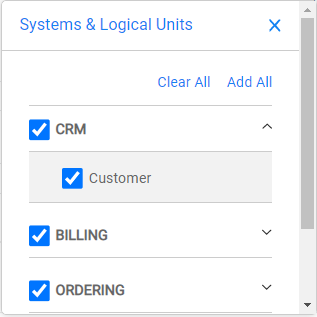

# Task - General Tab

This is the first task tabs and defines the main information on the task. The following information is populated in the General tab:

1. **Task title (name)**. A free text. Note that the task title must 

2. [Task Actions](14_task_overview.md#task-actions-types): Extract, Generate, Load, Delete, and Reserve. 

   At least one task action must be set on the task.

3. **Business Entity**: the task's [BE](04_tdm_gui_business_entity_window.md). Select a BE from the dropdown list of all the TDM BEs.

4. **Environments**: the environments that need to be set depend on the selected task actions:

   <table width="700pxl">
   <tbody>
   <tr>
   <td width="300pxl">
   
<strong>Task Type</strong>

   </td>
   <td width="400pxl">
   
<strong>Selected Environments</strong>

   </td>
   </tr>
   <tr>
   <td width="312">
   
The task actions include <strong>Load</strong> (provisioning)

   </td>
   <td width="312">
   <ul>
   <li>Extract from Environment</li>
   <li>Load to Environment</li>
   </ul>
   </td>
   </tr>
   <tr>
   <td width="312">
   
The task actions include <strong>Generate</strong>

   </td>
   <td width="312">
   <ul>
   <li>Extract from Environment is not needed since the entities are synthetically generated.</li>
   <li>Load to Environment is needed if the Load task action is checked with the Generate task action.</li>
   </ul>
   </td>
   </tr>    
   <tr>
   <td width="312">
   
<strong>Extract</strong> only

   </td>
   <td width="312">
   <ul>
   <li>Extract from Environment</li>
   </ul>
   </td>
   </tr>
   <tr>
   <td width="312">
   
<strong>Delete</strong> only

   </td>
   <td width="312">
   <ul>
   <li>Delete from Environment</li>
   </ul>
   </td>
   </tr>
   <tr>
   <td width="312">
   
<strong>Reserve</strong> only

   </td>
   <td width="312">
   <ul>
   <li>Reserve in Environment</li>
   </ul>
   </td>
   </tr>
   </tbody>
   </table>

   On each environment, the user needs to select one TDM environment from the dropdown list. The dropdown list displays the list of available environments for the user. Only environments that contain [systems with the select task's BE](11_environment_products_tab.md) are displayed.   

5. **Advanced Business Entity Options**, this is an **optional** setting that enables a partial selection of the systems or LUs in the task. The following popup window is opened when clicking this setting:

   

   

The popup window displays the list of systems that are attached to the task's environments and have the task's BE. You can clear the checkbox next to a system to remove all its LUs from the task, or click the expand icon next to the system to view it LUs and clear the LUs that need to be removed from the task. 

Note that is the **Advanced Business Entity Options** is not edited, then the task includes all the LUs that are related to the environments' systems with the task's BE.

 

