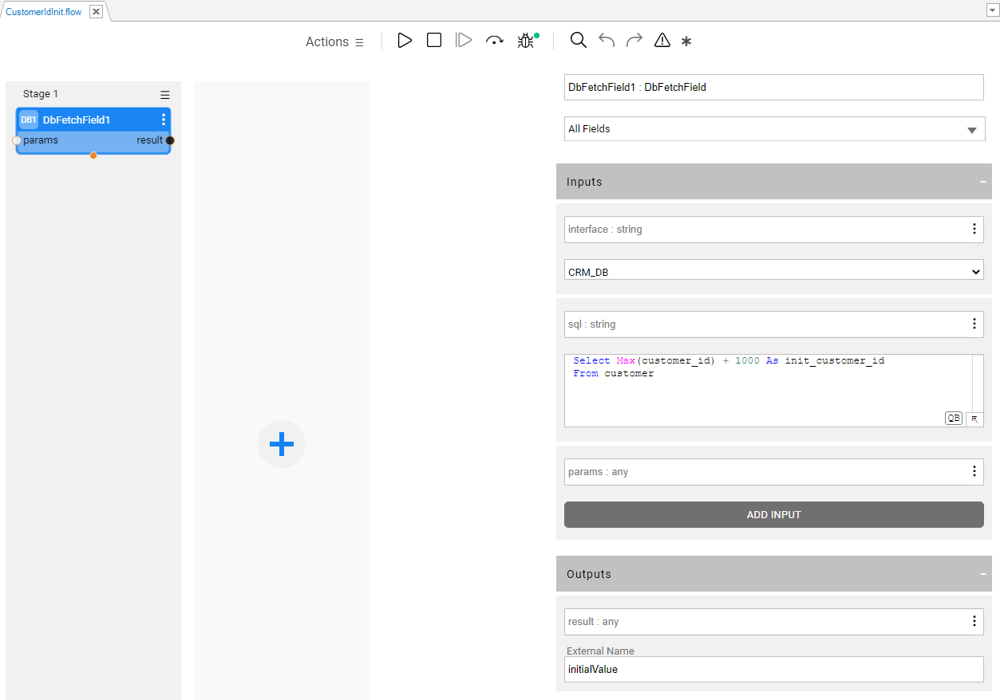
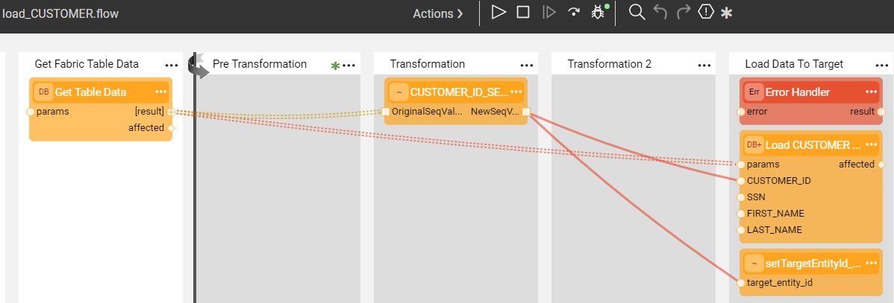
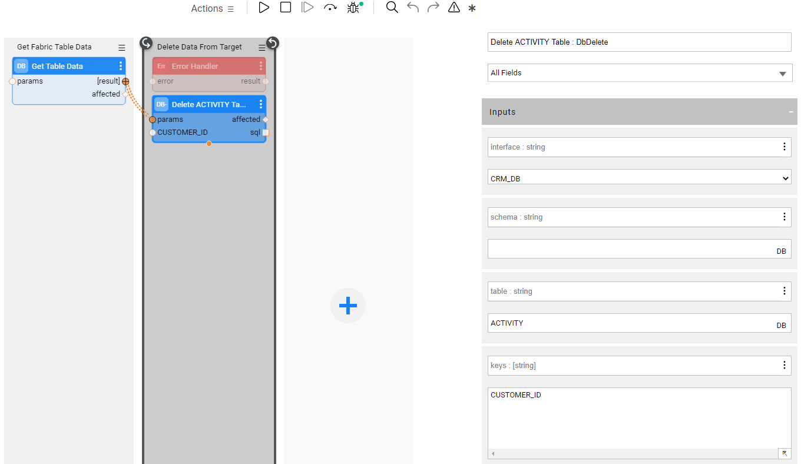
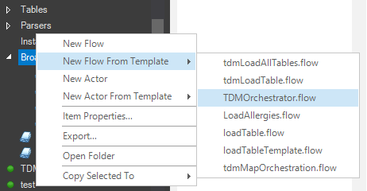

# Broadway Flows Implementation

The TDM library has sets of generic flows that enable creating a standard TDM implementation in just a few minutes. Note that once a standard implementation has been created, its flows can be edited and tailored to your project's specific requirements.

## How Do I Create TDM Broadway Flows?

### Step 1 - Define Tables to Filter Out

Before beginning to create Broadway flows, define the tables that are filtered out during the DELETE and LOAD flows. The library includes settings for the following filtered auxiliary tables:

This setting is implemented using the **TDMFilterOutTargetTables** Actor. To filter more tables, open the **TDMFilterOutTargetTables** Actor and edit its **table** object. The **lu_name** column should be populated as follows:

* ALL_LUS, when a filtered table is relevant for all TDM LUs.
* [LU name], when a table belongs to a specific LU.

After the Actor's update is completed, refresh the project by clicking the  button on top of the project tree to apply the changes in the **TDMFilterOutTargetTables** Actor and deploy the LU.

### Step 2 - Create Sequences

Sequences are required when populating a target DB, thus setting and initiating sequences is a mandatory part of creating a TDM implementation. 

If the **k2masking** keyspace does not exist in the DB interface defined for caching the masked values, create it using the **masking-create-cache-table.flow** from the library of Broadway examples or using the installation SQL script provided as part of the Masking library. After creating the **k2masking** keyspace, get the **update_tdm_sequence_mapping.sql** script from the [TDM Library](04_fabric_tdm_library.md) and run it on Cassandra DB to recreate **TDM_SEQ_MAPPING** table with the correct structure. 

Do the following to create the sequences for your TDM implementation:

1. TDM library includes a **TDMSeqList** Actor that holds a list of sequences. Populate the Actor's  **table** object with the information relevant for your TDM implementation:
   - **SEQUENCE_NAME**, the sequence name must be identical to the DB's sequence name if the next value is taken from the DB.
   - **CACHE_DB_NAME**, populate this setting using **DB_CASSANDRA** where the Sequence Cache tables are stored.
   - **SEQUENCE_REDIS_OR_DB**, indicates if the next value is taken from Redis or the target DB interface. Populate this setting using the **FabricRedis** interface (imported from the TDM library) or with the **target DB interface name**.
   - **INITIATE_VALUE_OR_FLOW**, set an initial value for the sequence or populate the name of an inner flow to apply logic when getting the initial value. For example, setting the initial value from the max value of the target table.

   Example of the tdmSeqList:

   

   Example of an inner flow to get the initial sequence value:
   
   
   
   The table's values are used by the **createSeqFlowsOnlyFromTemplates** flow that generates the Sequences Actors. 

   After the Actor's update is completed, refresh the project by clicking the  button on top of the project tree to apply the changes in the **TDMSeqList** Actor and deploy the **TDM LU**.

2. Run **createSeqFlowsOnlyFromTemplates.flow** from the Shared Objects ScriptsforTemplates folder. The flow has two [Inner Flows](/articles/19_Broadway/22_broadway_flow_inner_flows.md) that first create a Broadway flow for each sequence and then create an Actor from each flow.

   Note that this flow should run once per TDM implementation and not per each LU since the sequences are used across several LUs in the TDM project.
   The sequences flows and Actors are created under **Shared Objects** to enable several LUs to use a Sequence Actor.

3. Edit each Load flow of the TDM project by adding a newly created Sequence Actor to the Transformation Stage. For example, edit **load_PAYMENT.flow** by adding the sequence to the **Transformation** Stage and connecting its input and output arguments to the relevant columns. 

   

4. Add **setTargetEntityId_Actor** to the Load flow of the **main target table** to populate **TARGET_ENTITY_ID** key by the target entity ID. For example, add the  **setTargetEntityId_Actor** to **load_Customer** flow and send the target customer ID as an input parameter to the actor:

   

### Step 3 - Create Load and Delete Flows

In this step you will run the generic **createFlowsFromTemplates.flow** from the Shared Objects Broadway folder to create the delete and load flows under the LU. The flow gets the **LU name**, **Target Interface**, and **Target Schema** as input parameters and executes the following inner flows:

   1. Create a LOAD flow per table

Performed by the **createLoadTableFlows.flow** that receives the Logical Unit name, target interface and target schema and retrieves the list of tables from the LU Schema. It then creates a Broadway flow to load the data into each table in the target DB. The name of each newly created flow is **load_[Table Name].flow**. For example, load_Customer.flow. The tables defined in Step 1 are filtered out and the flow is not created for them. 

   2. Create the main LOAD flow

Performed by the **createLoadAllTablesFlow.flow** that receives the Logical Unit name and creates an envelope **LoadAllTables.flow** Broadway flow. The purpose of this flow is to invoke all LOAD flows based on the LU Schema's execution order.

   3. Create a DELETE flow per table

Performed by the **createDeleteTableFlows.flow** that receives the Logical Unit name, target interface and target schema and retrieves the list of tables from the LU Schema. It then creates a Broadway flow to delete the data from this table in the target DB. The name of each newly created flow is **delete_[Table Name].flow**. For example, delete_CUSTOMER.flow. The tables defined in Step 1 are filtered out and the flow is not created for them. 

The following two updates must be performed manually:

* Populate the **sql** input argument of the **Get Table Data** Actor with the SELECT query that retrieves the keys of the data to be deleted. For example, in the delete_ACTIVITY.flow, write the following query since the CUSTOMER_ID and ACTIVITY_ID are the keys of the ACTIVITY table.

  ~~~sql
  SELECT CUSTOMER_ID, ACTIVITY_ID FROM TAR_ACTIVITY;
  ~~~

  

* Populate the **keys** input argument of the **DbDelete** Actor. These should correlate with the table's keys.

  

   4. Create the main DELETE flow

Performed by the **createDeleteAllTablesFlow.flow** that receives the Logical Unit name and creates an envelope **DeleteAllTables.flow** Broadway flow. The purpose of this flow is to invoke all DELETE flows in the opposite order of the population order, considering the target DB's foreign keys. 

### Step 4 - Create the TDMOrchestrator.flow from the Template

Once all LOAD and DELETE flows are ready, create an orchestrator. The purpose of the **TDMOrchestrator.flow** is to encapsulate all Broadway flows of the TDM task into a single flow. It includes the invocation of all steps such as:

* Initiate the TDM load.
* Delete the target data, if required by the task's [operation mode](/articles/TDM/tdm_gui/19_load_task_request_parameters_regular_mode.md#operation-mode) or the [Data Flux load task](/articles/TDM/tdm_gui/20_load_task_dataflux_mode.md).
* Load the new data into the target, if required by the task's [operation mode](/articles/TDM/tdm_gui/19_load_task_request_parameters_regular_mode.md#operation-mode) or the [Data Flux load task](/articles/TDM/tdm_gui/20_load_task_dataflux_mode.md). 
* Manage the TDM process as one transaction.
* Perform [error handling and gather statistics](12_tdm_error_handling_and_statistics.md). 

The **TDMOrchestrator.flow** should be created from the Logical Unit's Broadway folder and is built for each Logical Unit in the TDM project. [Deploy the Logical Unit](/articles/16_deploy_fabric/01_deploy_Fabric_project.md) to the debug server and then create the Orchestrator flow using a template as follows:

### Step 5 - Mask the Sensitive Data

TDM systems often handle sensitive data. To be compliant with Data Privacy laws, Fabric enables masking sensitive fields like SSN, credit card numbers and email addresses before they are loaded either to Fabric or into the target DB.

* To mask a sensitive field prior to loading it into Fabric, create a Broadway population flow for the table that includes this field and add one or more **Masking** Actors. 

  

* To mask a sensitive field as part of Load to the Target DB, add a Masking Actor to the relevant **load_[Table Name].flow**. The TDM infrastructure controls enabling or disabling masking based on the settings of the global variables. There are three possible scenarios for handling masking:

  * When the TDM task is for synthetic data creation, masking is always enabled.
  * When The TDM task is for Data Flux, masking is always disabled.
  * In all other scenarios masking behavior depends on the MASK_FLAG settings.
  
* Note that there is no need to add a masking on both processes, LUI Sync and the Load flow, for synthetic data creation, since the TDM task execution process duplicates the clonned entity ID, set in the task, and attaches a different clone_id on each clone. Each clone gets its own masked value by the LUI sync. 
 
[Click to learn how to use Masking Actors](/articles/19_Broadway/actors/07_masking_and_sequence_actors.md#).
[Click to learn how the TDM task execution process builds the entity list](/articles/TDM/tdm_architecture/03a_task_execution_building_entity_list_on_tasks_LUs.md).

