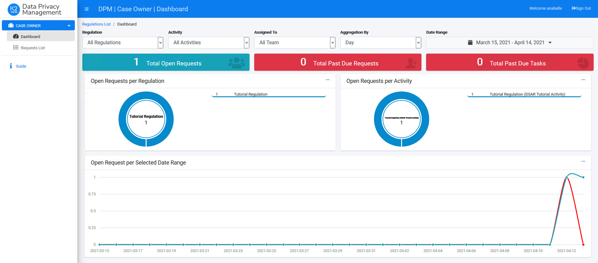
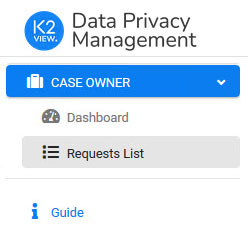

## Case Owner Views Submitted Request

In this tutorial, you will login to the DPM system as a Case Owner and view the request that was just submitted by the customer. The Case Owner can view the full list of Tasks that compose the Request, and they can communicate with data stewards by adding notes to the Task details. 

This process is not required as part of the fulfillment process. The purpose of including it here is to present a high-level view of the Request. 

Login as a user with a Case Owner role using the following credentials.

- **Username**: case_owner
- **Password**: k2view

The DPM system displays the Case Owner Dashboard. The Dashboard should be mostly empty, because the only Request submitted so far is the DSAR Request you submitted in the first tutorial section.  

    

On the left side of the screen, the Case Owner menu options display.

    

Select **Requests List**. The list of Requests that are under the responsibility of this Case Owner displays.

identify the Request we previously submitted in the table. Observe that the Request **Risk/Status** is "In Progress".

Click the Request line in the table to display the Request details.

You can view the list of Tasks that comprise this Request, along with the status of each Task. Depending on how much time passed between the submission of the Request and this step, the automatic Tasks may have already been completed, as depicted in the image above. 

If you click any of the Task lines, a detail screen for that Task displays. In the Task details, the case owner can perform different activities such as taking ownership of the Task ("Get"), completing the task manually, or adding comments which can be later viewed by the data steward allocated to this Task.

To view this functionality, click the Task called **Legal Review**. Add a note from the case owner to the data steward as shown in the image below.

You may also observe on the right side of the screen the information that was provided by the customer at the request submission.

For automatic Tasks, if an error occurred during the process, the system displays the error as a message. This is similar to the notes between the case owner and the data steward, but it is marked in red. 

Close the Task details screen and logout from the DPM system. 

