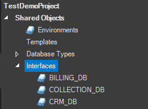

# FABRIC DEMO PROJECT 

The Fabric Knowledge Base project includes a set of Logical Units, code examples and objects that are used in all Knowledge Base articles and Learning Items. It uses four SQLite databases as the data source. Follow the below steps to setup the demo project on your local Fabric.

## Setup Steps

To setup the project and connect the databases, do the following:

1. Open the Fabric Studio and create a new project.

2. Download the [KB_FABRIC_PROJECT.k2export](KB_FABRIC_PROJECT.k2export) file and import it to your project as follows:

    

3. Download the [BILLING_DB.db](SqliteDB/billing_db.db), [CRM_DB.db](SqliteDB/crm_db.db), [COLLECTION_DB.db](SqliteDB/collection_db.db) and [ORDERS_DB.db](SqliteDB/orders_db.db) files locally on your computer.

4. Edit the CRM_DB, BILLING_DB, COLLECTION_DB and ORDERS_DB Interfaces, as follows:
    - Open the Interfaces from the Project tree.

      

    - Edit the **Database** field, setting the location of the *.db file to the local directory.

      

    - Test the connection by clicking on Test Connection String link. 

    - Save the changes and close the DB interface.

    [Click for more information about DB Connection Settings](/articles/05_DB_interfaces/03_DB_interfaces_overview.md).

## BI Configuration and Setup

To setup the BI and generate the example reports and dashboards using the demo project data, do the following:

1. ​