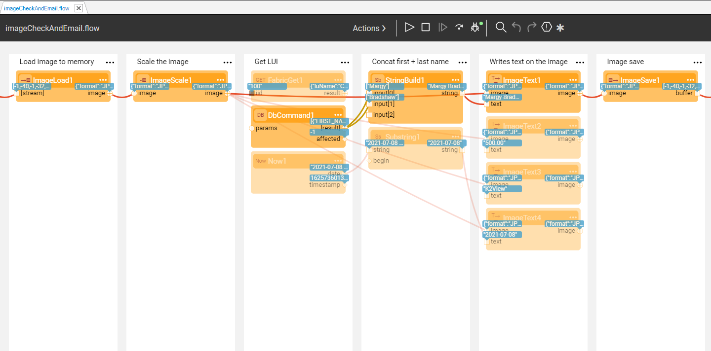
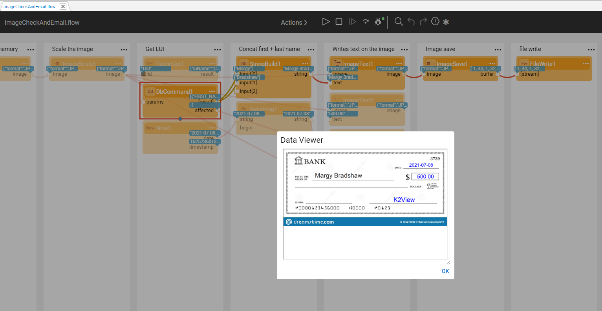

###  In the Spotlight: Image Manipulation Actors

Fabric provides a set of built-in image manipulation Actors that allow to perform various activities, such as:

- Load an image into a flow.
- Write text on a given image.
- Clone an image in memory.

The Actors are:

* **ImageLoad**, receives a buffer or buffer stream, and loads the image into memory.
* **ImageSave**, , encodes the image to a byte buffer with the given format. This can then be transported or saved using DbLoad, FileWrite, Http or other Actors.
* **ImageText**, **ImageScale**, **ImageDuplicate** and **ImageCreateCheck**

Let's check how it works by reviewing the below example flow. The purpose of this flow is to retrieve the empty bank check and populate it with the customer data, retrieved from LU.

We start from loading the image into memory using the **ResourceLoad** and **ImageLoad** Actors. To load the image from the Fabric resource, place it to your Fabric's server resources folder (e.g. C:\K2View\Fabric_6.5\Server\fabric\resources). 

Then we get the customer data from LU and write it into predefined places in the image. At the end, we save the updated image to a predefined interface (e.g. local file system).

